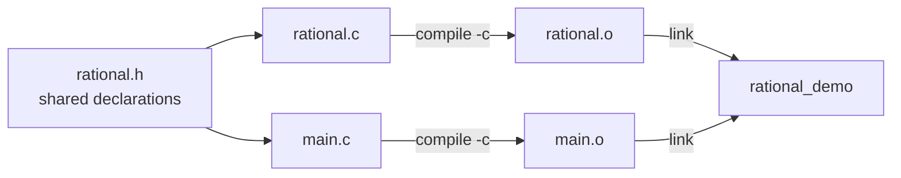
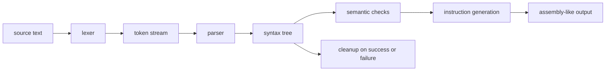

# Week 3 Lecture Notes — Structures, Modules, Builds, and Debugging

> September 22, 2026 · Source lineage: previous structures, multi-file build,
> program-style, and debugging notes

> Python bridge: [Python Contrast Companion for Week 3](week03_python_companion.md)

---

## Student route

- **Core:** state a `struct` invariant, separate declarations from definitions,
  compile multiple translation units, and diagnose one failure from evidence.
- **Practice:** complete the [Week 3 exercise](lecture_exercises/week03_ex.md)
  before comparing with [the complete example](examples.c).
- **Supporting ideas:** build-system conveniences are useful, but the required
  model is source files to object files to one linked program.
- **Python bridge:** use the companion when fixed-layout records or separate
  compilation have no direct Python analogue.

---

## Learning objectives

By the end of this lecture, you should be able to:

1. Model a record with `struct`, `enum`, and `typedef` appropriately.
2. Separate a public interface from a private implementation.
3. Explain declarations, definitions, object files, and link errors.
4. Build and debug a multi-file C program.
5. State and check representation invariants.

---

## Three-hour plan

| Hour | Main question | In-class production |
|------|---------------|---------------------|
| 1 | How do records become reliable abstractions? | Design tokens and rational values with invariants |
| 2 | How do source files become one program? | Build a three-file module and diagnose link failures |
| 3 | How do tests and tools turn failure into evidence? | Debug a seeded multi-file defect and add a regression test |

Each hour interleaves about 35–45 minutes of explanation and live coding with
roughly 15–20 minutes of core practice. The remaining time supports questions,
transitions, and a short break. Exercises labelled **Extension** can move to the
lab or independent study when the class needs more time on a core idea.

### Inline practice routine

Each **Try it now** activity follows the same short cycle:

1. predict the result, state change, build artifact, or diagnostic;
2. write or edit the smallest relevant fragment;
3. compile C with `-std=c17 -Wall -Wextra -Wpedantic`;
4. run the stated normal and boundary cases; and
5. explain which representation invariant or build rule justifies the result.

Only the question is initially visible. Expand **Reveal solution** after making
and checking an attempt. Each solution identifies expected output, build
evidence, or the reason a declaration-only example has no run-time output.

- **Core live:** part of the planned in-class route.
- **Extension:** additional practice for the lab, a break, or later study.

The core-live exercises total about 19 minutes in Hour 1, 17 minutes in Hour 2,
and 19 minutes in Hour 3.

---

## Hour 1 — Records, tagged data, and invariants

> **Hour 1 route:** [Structures group related values](#1-structures-group-related-values)
> → [Tagged alternatives with `enum`](#2-tagged-alternatives-with-enum)
> → [Invariants turn records into abstractions](#3-invariants-turn-records-into-abstractions)
> → [Designated initializers and partial initialization](#designated-initializers-and-partial-initialization)
> → [Tagged unions](#tagged-unions)
> → [design exercise](#try-it-now-core-live--hour-1-design-exercise-5-minutes)

### 1. Structures group related values

A Python dictionary or simple class can group heterogeneous fields. The C
equivalent declares a fixed set and order of members. The compiler chooses
target-dependent offsets and may insert padding between members, but every
`struct Student` object has the same representation within one program:

```c
#include <stdio.h>

struct Student {
  int id;
  char name[32];
  double grade;
};

int main(void) {
  struct Student student = {1001, "Ada", 92.5};
  printf("%s: %.1f\n", student.name, student.grade);
  return 0;
}
```

```text
one Student object (conceptual, not to scale)
┌────────┬──────────────────────────────┬──────────┬─────────┐
│ id     │ name[0] ... name[31]        │ padding? │ grade   │
└────────┴──────────────────────────────┴──────────┴─────────┘
```

Member order is preserved, but exact offsets, padding, and total size belong to
the implementation. Use `sizeof(struct Student)` when the actual object size is
needed; do not compute it by manually adding the member sizes.

The dot operator selects a member of a structure object. Here `student.name` is
the embedded 32-element character array, and `student.grade` is a `double`.
The positional initializer follows member order; designated initializers later
make the correspondence explicit.

The complete program prints:

```text
Ada: 92.5
```

Inside the same block, assignment or initialization from another structure
copies all members into a distinct structure object:

```c
struct Student copy = student;
```

An array member is copied as part of the structure even though a standalone
array cannot be assigned. A pointer member, by contrast, copies only its pointer
value; it does not copy the separate object to which that pointer refers.
Passing a structure by value also copies all its members. Pass a pointer when a
function must modify the caller's record or when copying a large record would
be needlessly expensive.

#### Try it now [Core live] — observe a structure copy (3 minutes)

Start from the complete program above. Add `copy` inside `main`, change
`copy.name[0]` to `'E'`, and change `copy.grade` to `88.0`. Print both records.
Predict whether changing the copy also changes the embedded array or grade in
`student`.

<details>
<summary>Reveal solution</summary>

This `main` belongs after the `struct Student` declaration above:

```c
#include <stdio.h>

int main(void) {
  struct Student student = {1001, "Ada", 92.5};
  struct Student copy = student;
  copy.name[0] = 'E';
  copy.grade = 88.0;

  printf("original=%s %.1f\n", student.name, student.grade);
  printf("copy=%s %.1f\n", copy.name, copy.grade);
  return 0;
}
```

Structure assignment copied every member, including all 32 elements of
`name`. The two records therefore contain independent arrays.

**Expected output:**

```text
original=Ada 92.5
copy=Eda 88.0
```

</details>

---

### 2. Tagged alternatives with `enum`

```c
enum TokenKind { TokenInteger, TokenPlus, TokenMinus, TokenEnd, TokenInvalid };

struct Token {
  enum TokenKind kind;
  int value;
};
```

An `enum` gives names to a finite set of integral cases. A variable of type
`enum TokenKind` should contain one of the declared alternatives. The `kind`
member tells us whether the remaining fields are meaningful: `value` holds a
parsed integer only when `kind == TokenInteger`. This tag-first rule becomes
part of the representation invariant and later supports tokens and syntax-tree
nodes in the compiler project.

Use `typedef` to name a genuinely useful abstraction, not to hide every type:

```c
typedef struct Token Token;
```

Both `struct Token` and `Token` are reasonable course styles; be consistent.

The `typedef` introduces an alias for an existing type; it does not allocate an
object, create a run-time conversion, or define a second representation.

#### Try it now [Core live] — make the tag control interpretation (3 minutes)

Create one integer token containing `17` and one plus token. Print `integer 17`
for the first and `plus` for the second. Read `value` only in the integer case.

<details>
<summary>Reveal solution</summary>

This `main` uses the `enum TokenKind`, `struct Token`, and `Token` alias above:

```c
#include <stddef.h>
#include <stdio.h>

int main(void) {
  Token integer_token = {TokenInteger, 17};
  Token plus_token = {TokenPlus, 0};
  Token tokens[] = {integer_token, plus_token};

  for (size_t i = 0; i < 2; ++i) {
    if (tokens[i].kind == TokenInteger) {
      printf("integer %d\n", tokens[i].value);
    } else if (tokens[i].kind == TokenPlus) {
      printf("plus\n");
    }
  }
  return 0;
}
```

The loop inspects the tag before reading the integer payload.

**Expected output:**

```text
integer 17
plus
```

</details>

---

### 3. Invariants turn records into abstractions

A representation invariant is a property that must hold whenever clients can
observe an object through the public interface. It narrows many possible field
combinations to the states the program promises to understand. For a rational
number in normalized form:

- denominator is nonzero;
- denominator is positive;
- numerator and denominator share no common factor except one.

```c
#include <stdbool.h>

typedef struct Rational {
  int numerator;
  int denominator;
} Rational;

bool rational_make(int numerator, int denominator, Rational* out);
```

The constructor-like function returns `true` only after publishing a normalized
value through `out`. Its contract requires a valid output pointer, rejects a
zero denominator, and leaves the destination unchanged on failure. This course
implementation also rejects `INT_MIN` in either numeric argument so every
negation performed by the normalization algorithm is guaranteed representable,
without depending on whether an implementation's signed range is symmetric.
The full implementation appears in Hour 2 as part of a multi-file module; the
separate starter asks you to attempt it before revealing that implementation.

Do not make every caller rediscover these rules. If all public creation and
mutation paths establish the invariant, later functions may reason from one
canonical representation: `1/2` rather than any of `2/4`, `-1/-2`, or `3/6`.

#### Try it now [Core live] — normalize on paper first (4 minutes)

For each request below, predict success or failure and, on success, the stored
members. Do not write the implementation yet.

- `rational_make(6, 8, &value)`
- `rational_make(2, -4, &value)`
- `rational_make(0, 5, &value)`
- `rational_make(1, 0, &value)`
- `rational_make(1, 2, NULL)`

<details>
<summary>Reveal solution</summary>

| Request | Status | Stored value or reason |
|---------|--------|------------------------|
| `6, 8, &value` | success | `3/4` after dividing by the common factor 2 |
| `2, -4, &value` | success | `-1/2`; the denominator becomes positive |
| `0, 5, &value` | success | `0/1`; zero has one canonical denominator |
| `1, 0, &value` | failure | a rational denominator cannot be zero |
| `1, 2, NULL` | failure | there is no valid destination to receive the result |

This is a contract trace, not an executable program, so it has no standard
output. A failed call must leave the previous destination value unchanged.

</details>

---

### Designated initializers and partial initialization

> **Supporting C syntax:** designated initializers improve clarity for records,
> but understanding structure members and invariants is more important than
> memorizing this initializer form.

C designated initializers make field meaning explicit and tolerate field order
changes better than positional initialization:

```c
struct Student student = {.id = 1001, .name = "Ada", .grade = 92.5};
```

Unspecified members are initialized to zero. This differs from an uninitialized
automatic structure, whose members have indeterminate values.

#### Try it now [Extension] — inspect partial initialization (2 minutes)

Initialize only `.id` in a `struct Student`, then print the ID, the numeric value
of `name[0]`, and the grade. Predict the two implicit values before compiling.

<details>
<summary>Reveal solution</summary>

This `main` uses the `struct Student` definition above:

```c
#include <stdio.h>

int main(void) {
  struct Student partial = {.id = 1002};
  printf("id=%d first-name-byte=%d grade=%.1f\n", partial.id,
         partial.name[0], partial.grade);
  return 0;
}
```

Because this declaration contains an initializer, every unmentioned member and
array element is zero-initialized.

**Expected output:**

```text
id=1002 first-name-byte=0 grade=0.0
```

</details>

---

### Tagged unions

> **Project-oriented representation:** tagged unions prepare for the token and
> syntax-tree alternatives used in Week 7. They are not a replacement for an
> ordinary `struct` when every member exists at the same time.

A `union` overlays several members in the same storage, so only one member's
value is active at a time. Because the storage alone does not remember which
member is active, reliable code pairs the union with an `enum` tag:

```c
enum ValueKind { ValueInteger, ValueReal, ValueError };

struct Value {
  enum ValueKind kind;
  union {
    long integer;
    double real;
    const char* error;
  } as;
};
```

Reading a union member inconsistent with `kind` violates the abstraction. This
combination of a tag and several alternative payloads is a general technique
for representing “exactly one of these cases.” Every function that reads the
payload must first inspect the tag, and every function that changes the case
must update the tag and payload together.

The `error` alternative is a borrowed pointer to an existing null-terminated
string. The structure does not own or copy that string, so the pointed-to text
must remain valid for every use of the `Value`. A string literal satisfies that
lifetime requirement for the entire program.

```c
#include <stdio.h>

void value_print(struct Value value) {
  switch (value.kind) {
    case ValueInteger:
      printf("integer=%ld\n", value.as.integer);
      break;
    case ValueReal:
      printf("real=%.1f\n", value.as.real);
      break;
    case ValueError:
      printf("error=%s\n", value.as.error);
      break;
  }
}
```

The function takes this small teaching record by value. It checks `kind` before
selecting the matching nested member such as `value.as.real`.

#### Try it now [Core live] — keep tag and payload synchronized (4 minutes)

Construct one value of each kind with designated initializers, call
`value_print`, and predict the output. Then explain why changing only `.kind`
after construction would break the invariant.

<details>
<summary>Reveal solution</summary>

This `main` uses the `ValueKind`, `Value`, and `value_print` definitions above:

```c
int main(void) {
  struct Value count = {.kind = ValueInteger, .as.integer = 42};
  struct Value ratio = {.kind = ValueReal, .as.real = 3.5};
  struct Value failure = {.kind = ValueError, .as.error = "bad input"};

  value_print(count);
  value_print(ratio);
  value_print(failure);
  return 0;
}
```

**Expected output:**

```text
integer=42
real=3.5
error=bad input
```

Changing only `ratio.kind` to `ValueInteger` would make the tag claim that the
overlapping bytes contain a stored `long`, even though the last stored union
member was `real`. A public operation must update both parts together.

</details>

---

### Try it now [Core live] — Hour 1 design exercise (5 minutes)

Design a `struct Date` and functions `date_make`, `date_next`, and `date_print`.
Decide which representation and operations belong in the public header. State
leap-year and valid-day invariants and give boundary tests for February, month
transitions, and invalid construction. After Week 4, revisit whether hiding the
representation behind an opaque pointer would improve the interface enough to
justify its ownership costs.

<details>
<summary>Reveal solution</summary>

One coherent public design is:

```c
#include <stdbool.h>
#include <stdio.h>

typedef struct Date {
  int year;
  int month;
  int day;
} Date;

bool date_make(int year, int month, int day, Date* out);
bool date_next(Date current, Date* out);
void date_print(FILE* stream, Date value);
```

The invariant requires `1 <= month && month <= 12` and a day between 1 and the
number of days in that particular month and year. A leap year is divisible by
4, except years divisible by 100 are not leap years unless divisible by 400.
The operations must also state what year range they support and what happens
when the next date would leave it.

Minimum boundary tests include February 28 in ordinary and leap years,
February 29 in a leap year, the last day of a 30-day month, December 31, month
zero, month 13, and days just below and above a month's valid range. These are
declarations and test requirements, so this design produces no run-time output
until implementations and a driver are supplied.

</details>

---

## Hour 2 — Headers, the preprocessor, and the build graph

> **Hour 2 route:** [Interfaces live in headers](#4-interfaces-live-in-headers)
> → [Separate compilation and linking](#5-separate-compilation-and-linking)
> → [Encapsulation before opaque ownership](#encapsulation-before-opaque-ownership)
> → [Preprocessor discipline](#preprocessor-discipline)
> → [A minimal Makefile](#a-minimal-makefile)
> → [failure lab](#hour-2-failure-lab)

### 4. Interfaces live in headers

`rational.h`:

```c
#ifndef RATIONAL_H
#define RATIONAL_H

#include <stdbool.h>
#include <stdio.h>

typedef struct Rational {
  int numerator;
  int denominator;
} Rational;

bool rational_make(int numerator, int denominator, Rational* out);
void rational_print(FILE* stream, const Rational* value);

#endif
```

The header contains the public type and function declarations needed by both
the implementation and its clients. It is **self-contained**: a source file may
include `rational.h` first without relying on another header to define `bool` or
`FILE`.

The three preprocessor directives form a **header guard**. On the first
inclusion, `RATIONAL_H` is not defined, so the declarations are retained and
the macro becomes defined. A repeated inclusion skips everything through the
matching `#endif`, preventing duplicate declarations within one translation
unit. The guard name must be unique to this header.

`FILE` is a standard-library type declared by `<stdio.h>`. A `FILE*` is a
handle through which functions read or write a stream such as standard output
or an opened file. This interface accepts a stream so the formatting logic is
not tied specifically to `stdout`; the pointer is borrowed and is not closed by
`rational_print`.

#### Try it now [Core live] — classify the header declarations (3 minutes)

For each line in `rational.h`, decide whether it provides a type definition, a
function declaration, a dependency, or a preprocessor guard. Then answer: why
does the header declare `rational_make` but not the private greatest-common-
divisor helper?

<details>
<summary>Reveal solution</summary>

- `<stdbool.h>` and `<stdio.h>` provide types used by the public declarations.
- The guarded `typedef struct Rational ... Rational;` defines the visible record
  and its alias.
- The two prototypes declare public operations without defining their bodies.
- The private helper belongs only in `rational.c`; exposing it would enlarge the
  public interface without helping clients use rational values.
- `#ifndef`, `#define`, and `#endif` prevent repeated inclusion in one
  translation unit.

A header is translated only as part of a source file that includes it. These
declarations alone therefore produce no executable and no run-time output.

</details>

The implementation includes its own header first. This immediately exposes a
header that is not self-contained and lets the compiler compare each definition
with the published declaration.

One new member spelling appears below: `out->numerator` is shorthand for
`(*out).numerator`—dereference the structure pointer, then select a member. A
validity check must happen before the first `->` use. The implementation also
uses `assert` as a development check for a violated internal precondition; Hour
3 explains assertion behavior and why assertions do not replace ordinary input
validation.

<details>
<summary>Reveal `rational.c` after attempting the starter constructor</summary>

```c
#include "rational.h"

#include <assert.h>
#include <limits.h>

static int gcd_positive(int left, int right) {
  if (left < 0) {
    left = -left;
  }
  if (right < 0) {
    right = -right;
  }
  while (right != 0) {
    const int remainder = left % right;
    left = right;
    right = remainder;
  }
  if (left == 0) {
    return 1;
  }
  return left;
}

bool rational_make(int numerator, int denominator, Rational* out) {
  if (out == NULL || denominator == 0 || numerator == INT_MIN ||
      denominator == INT_MIN) {
    return false;
  }
  if (denominator < 0) {
    numerator = -numerator;
    denominator = -denominator;
  }
  const int divisor = gcd_positive(numerator, denominator);
  out->numerator = numerator / divisor;
  out->denominator = denominator / divisor;
  return true;
}

void rational_print(FILE* stream, const Rational* value) {
  assert(stream != NULL);
  assert(value != NULL);
  assert(value->denominator > 0);
  fprintf(stream, "%d/%d", value->numerator, value->denominator);
}
```

`static` gives `gcd_positive` internal linkage, so other translation units
cannot name that helper. Failed construction returns before either output
member changes. This teaching representation rejects `INT_MIN`; a production
numeric type should document or redesign that range limitation explicitly.

`rational.c` has no `main`, so compiling it alone with `-c` produces an object
file but no run-time output.

</details>

A client contains the program entry point and uses only the public header:

`main.c`:

```c
#include "rational.h"

#include <stdio.h>

int main(void) {
  Rational value;
  if (!rational_make(2, -4, &value)) {
    fputs("could not construct rational value\n", stderr);
    return 1;
  }
  rational_print(stdout, &value);
  fputc('\n', stdout);
  return 0;
}
```

#### Try it now [Core live] — build and run the module (5 minutes)

Create the three files exactly as shown. Predict which command produces each
object file and which command produces the executable. Build and run the
program, then change the request to `6/8` without editing `rational.c`.

<details>
<summary>Reveal solution</summary>

```sh
cc -std=c17 -Wall -Wextra -Wpedantic -g -c rational.c -o rational.o
cc -std=c17 -Wall -Wextra -Wpedantic -g -c main.c -o main.o
cc rational.o main.o -o rational_demo
./rational_demo
```

The successful build commands normally print nothing. Their file outputs are
`rational.o`, `main.o`, and `rational_demo`, respectively.

**Expected program output for `2/-4`:**

```text
-1/2
```

After changing only the call in `main.c` to `rational_make(6, 8, &value)`, the
program prints:

```text
3/4
```

</details>

---

### 5. Separate compilation and linking

Each `.c` file is preprocessed and compiled as its own **translation unit**.
Including `rational.h` copies the same declarations into both units, but only
`rational.c` supplies the public function definitions. The linker later connects
the calls in `main.o` with those definitions in `rational.o`.

```sh
cc -std=c17 -Wall -Wextra -Wpedantic -g -c rational.c -o rational.o
cc -std=c17 -Wall -Wextra -Wpedantic -g -c main.c -o main.o
cc rational.o main.o -o rational_demo
```



- Each `-c` command creates one object file without linking.
- The final command resolves cross-file references and creates the executable.
- An **implicit declaration** diagnostic usually means a call was compiled
  without a visible prototype.
- A **conflicting types** diagnostic means declarations or a declaration and
  definition disagree within a translation unit.
- A **multiple definition** link error means more than one object exports the
  same ordinary definition.
- An **undefined reference** link error means no linked object supplies a
  required definition.

Include your own header first in its implementation file. If the header is not
self-contained, the mistake is found close to its source.

#### Try it now [Core live] — locate responsibility in the build graph (4 minutes)

Predict the earliest failing stage and likely diagnostic category for each
change. Test one change at a time and restore it before continuing.

1. Remove `#include "rational.h"` from `main.c` but keep the calls.
2. Compile both files correctly but link only `main.o`.
3. Change the header's return type to `int` without changing `rational.c`.
4. Restore every file and link both objects.

<details>
<summary>Reveal solution</summary>

| Change | Earliest evidence | Reason |
|--------|-------------------|--------|
| Missing include in `main.c` | compilation diagnostic | `Rational` and the prototypes are not declared in that translation unit |
| Link only `main.o` | undefined-reference link error | the client calls functions defined in omitted `rational.o` |
| Header says `int`, source defines `bool` | conflicting-types compilation diagnostic in `rational.c` | the implementation includes the header before its definition |
| Restored files and both objects | successful link and `-1/2` at run time | declarations and definitions agree and every reference is supplied |

Failed compilation or linking produces no program output because no valid
executable is created. Exact diagnostic wording depends on the toolchain.

</details>

---

### Encapsulation before opaque ownership

> **Design preview:** opaque pointer interfaces become important when a module
> must hide a dynamically owned representation. This week keeps the structure
> visible so the separate-compilation model remains the main idea.

A module can begin with a visible structure definition while still requiring
clients to use its functions:

```c
/* counter.h */
struct Counter {
  long value;
};

void counter_initialize(struct Counter* counter);
void counter_increment(struct Counter* counter);
long counter_value(const struct Counter* counter);
```

The visible layout means the compiler knows how much storage a `Counter` needs,
so a client can declare one directly. The function contracts still centralize
valid initialization and state changes. This is convention-based
encapsulation: the compiler does not prevent a client from writing `value`.

#### Try it now [Extension] — separate layout from permitted operations (3 minutes)

For each declaration in `counter.h`, state what a client must establish and
what the operation promises. Which direct member assignment can the compiler
still accept even though it bypasses the intended interface?

<details>
<summary>Reveal solution</summary>

- `counter_initialize` requires a valid writable pointer and establishes the
  module's initial state.
- `counter_increment` requires a previously initialized writable object and
  advances its value according to the module policy.
- `counter_value` requires a valid initialized object, does not modify it, and
  returns the observation.
- Because the definition is visible, a client can still write
  `counter.value = -100;`. The header communicates a convention but cannot
  prevent this access.

The header contains declarations only, so it produces no run-time output.

</details>

A stronger design can hide the members behind an incomplete, or **opaque**,
structure type. Doing so normally requires clients to manipulate pointers and
raises allocation and destruction questions. Week 4 introduces the necessary
pointer, lifetime, and ownership model before presenting that interface. The
ordering matters: hiding representation is useful only when we can also state
who creates, owns, and destroys the hidden object.

---

### Preprocessor discipline

> **Supporting C tooling:** recognize header guards and simple macros, but
> prefer typed functions and constants for ordinary program logic.

Object-like macros perform token substitution and have no type:

```c
#define BUFFER_CAPACITY 256
```

Function-like macros can evaluate arguments more than once:

```c
#define BAD_SQUARE(x) ((x) * (x))
/* BAD_SQUARE(i++) modifies i twice without sequencing: undefined behavior. */
```

Prefer `enum` constants, `const` objects, and functions when they express the
same intent. Use conditional compilation for genuine platform or build choices,
not to hide multiple unrelated implementations in one file.

#### Try it now [Extension] — inspect substitution before execution (3 minutes)

Expand `BAD_SQUARE(i++)` by hand. Do not run the expanded expression. Replace
the macro with a typed function that evaluates its argument once, then test that
function with an ordinary value.

<details>
<summary>Reveal solution</summary>

Textual substitution produces:

```c
((i++) * (i++))
```

The two unsequenced modifications of `i` make the expression undefined. Extra
parentheses cannot repair multiple evaluation. A function evaluates its
argument before the call and uses the resulting value through a parameter:

```c
int square(int value) {
  return value * value;
}
```

For inputs whose square is representable as `int`, `printf("%d\n", square(5));`
prints:

```text
25
```

</details>

---

### A minimal Makefile

> **Tooling reference:** students need to understand the compile and link
> commands. Memorizing Makefile syntax is not a C-language objective.

```make
CC = cc
CFLAGS = -std=c17 -Wall -Wextra -Wpedantic -g

rational_demo: main.o rational.o
	$(CC) main.o rational.o -o rational_demo

main.o: main.c rational.h
	$(CC) $(CFLAGS) -c main.c

rational.o: rational.c rational.h
	$(CC) $(CFLAGS) -c rational.c
```

The dependency edges explain what must be rebuilt after a header changes. Make
is not the compiler; it decides which compiler/linker commands are out of date.

The indented recipe lines must begin with a tab because that character is part
of traditional Makefile syntax. The variables reduce duplication; `$(CC)` and
`$(CFLAGS)` are expanded by Make before it runs the resulting shell command.

#### Try it now [Extension] — predict the rebuild set (4 minutes)

After one successful `make rational_demo`, predict which commands run after
touching only `main.c`, only `rational.c`, and then `rational.h`. Explain each
answer from the dependency lines rather than memorizing Make behavior.

<details>
<summary>Reveal solution</summary>

| Changed file | Recompiled objects | Relink? |
|--------------|--------------------|---------|
| `main.c` | `main.o` | yes |
| `rational.c` | `rational.o` | yes |
| `rational.h` | both `main.o` and `rational.o` | yes |

If every target is already newer than its prerequisites, Make commonly reports
that the target is up to date and runs no recipe. Exact status wording is
implementation-dependent; the dependency decisions above are the required
result.

**Expected terminal evidence:** unless recipes are silenced, Make prints each
compiler or linker command that it chooses to run. The table predicts that
command set; the program itself is not executed by this Makefile.

</details>

---

### Hour 2 failure lab

#### Try it now [Core live] — classify five failures (5 minutes)

Seed and classify these defects in a three-file program:

1. omit a header dependency from the Makefile;
2. declare `double mean(...)` but define `int mean(...)`;
3. define a non-`static` helper with the same name in two source files;
4. place a function definition in a header included by both source files;
5. change a function body without relinking.

For each, identify the first stage capable of detecting the defect.

<details>
<summary>Reveal solution</summary>

| Seeded defect | First reliable evidence |
|---------------|-------------------------|
| Header dependency omitted from Makefile | a stale-build failure after the header changes; Make incorrectly skips an object whose source view is now outdated |
| Header declares `double mean(...)`, source defines `int mean(...)` and includes that header | compile-time conflicting-types diagnostic |
| Two source files export the same non-`static` helper | multiple-definition link error |
| Ordinary function definition placed in a header included by two source files | each file compiles, then linking reports multiple definitions |
| Function body changed but executable not relinked | no diagnostic from the stale executable; its behavior and timestamps reveal that the new object was not incorporated |

The missing Make dependency is a build-graph defect rather than a C diagnostic.
It may stay hidden until a header changes, which is why a clean build alone does
not prove that dependency declarations are complete. Failed builds have no
run-time output because the intended executable was not produced or refreshed.

</details>

---

## Hour 3 — Assertions, file boundaries, tests, and debugging

> **Hour 3 route:** [Assertions, tests, and debugger evidence](#6-assertions-tests-and-debugger-evidence)
> → [File I/O is another contract boundary](#file-io-is-another-contract-boundary)
> → [Debugging studio: invariant first](#debugging-studio-invariant-first)
> → [Style as a correctness tool](#7-style-as-a-correctness-tool)
> → [project pipeline map](#midterm-project-connection--map-before-modifying)

### 6. Assertions, tests, and debugger evidence

Use assertions for internal conditions that indicate a programmer error:

```c
#include <assert.h>
#include <stddef.h>

int array_sum(const int values[], size_t count) {
  assert(values != NULL || count == 0);
  int total = 0;
  for (size_t i = 0; i < count; ++i) {
    total += values[i];
  }
  return total;
}
```

This teaching version requires the mathematical sum to be representable as an
`int`. An interface for unrestricted inputs must use checked arithmetic or
report overflow explicitly.

`assert(condition)` is a macro from `<assert.h>`. When the condition is false in
an assertion-enabled build, the implementation reports diagnostic context and
terminates the program abnormally. The exact text is not portable. Defining
`NDEBUG` before including `<assert.h>`, commonly through the compiler option
`-DNDEBUG`, disables assertions. Therefore:

- use assertions for violated internal assumptions that indicate a programming
  defect;
- validate malformed input, missing files, and other expected failures with
  ordinary control flow; and
- never put a required assignment, function call, or other side effect only
  inside an assertion.

#### Try it now [Core live] — separate a checked invariant from input handling (4 minutes)

Call `array_sum` for `{4, -1, 3}` and for `NULL` with `count == 0`. Predict both
results. Then classify `array_sum(NULL, 1)` without running it: what does an
assertion-enabled build detect, and why would disabling assertions not make the
call valid?

<details>
<summary>Reveal solution</summary>

```c
#include <stdio.h>

int main(void) {
  int values[] = {4, -1, 3};
  printf("sum=%d empty=%d\n", array_sum(values, 3), array_sum(NULL, 0));
  return 0;
}
```

**Expected output:**

```text
sum=6 empty=0
```

For `array_sum(NULL, 1)`, the assertion condition is false and an enabled
assertion should terminate the program before the loop dereferences `NULL`.
With `NDEBUG`, that check disappears and the later access is undefined
behavior. The precondition remains part of the interface in every build, so do
not run the invalid call as an ordinary test.

</details>

A practical debugging loop is:

1. Reproduce the smallest failing input.
2. State the expected and observed behavior.
3. Compile with warnings and sanitizers.
4. Stop at a relevant line in the debugger.
5. Inspect control flow and data; do not guess blindly.
6. Add a regression test before or with the fix.

<details>
<summary>Side note — build an instrumented executable</summary>

On a compiler and platform that provide AddressSanitizer and UndefinedBehavior-
Sanitizer, a diagnostic build commonly uses:

```sh
cc -std=c17 -Wall -Wextra -Wpedantic -g -O0 \
  -fsanitize=address,undefined -fno-omit-frame-pointer \
  main.c rational.c -o rational_demo_sanitized
```

`-O0` keeps the source/debugger relationship straightforward,
`-fsanitize=address,undefined` adds run-time checks for supported memory and
undefined-behavior categories, and `-fno-omit-frame-pointer` often improves
diagnostic stack traces. These options are compiler facilities rather than C17
language features, and availability varies by toolchain.

A successful compilation normally prints nothing. Running a valid test may
also produce no sanitizer message; the absence of a report covers only the
executed paths and is not a proof that the whole program is correct.

</details>

Typical debugger commands are `break`, `run`, `next`, `step`, `print`, and
`backtrace`. Learn the concepts; the exact command spelling varies by debugger.

---

### File I/O is another contract boundary

> **Supporting interface technique:** stream parameters make code testable, but
> the central lesson is still to state input, output, and failure contracts.

The header example earlier in this note introduced `FILE*` as a borrowed stream
handle. A module can accept such a handle instead of opening a hard-coded path:

```c
#include <stdbool.h>
#include <stddef.h>
#include <stdio.h>

bool students_read(FILE* input, struct Student students[], size_t capacity,
                   size_t* count) {
  if (input == NULL || count == NULL || (students == NULL && capacity != 0)) {
    return false;
  }
  *count = 0;
  while (*count < capacity) {
    struct Student next;
    const int converted =
        fscanf(input, "%d %31s %lf", &next.id, next.name, &next.grade);
    if (converted == EOF) {
      return feof(input) != 0;
    }
    if (converted != 3) {
      return false;
    }
    students[(*count)++] = next;
  }
  const int extra = fscanf(input, "%*s");
  return extra == EOF && feof(input) != 0;
}
```

Receiving `FILE*` makes the parser testable with redirected files or temporary
streams. It also separates “where bytes come from” from “how records are
parsed.” The record grammar is three whitespace-separated fields: an `int` ID,
a word of at most 31 stored characters, and a `double` grade. As in Week 1, the
contract assumes numeric tokens are representable by their destination types.

The function publishes each complete record immediately. If a later record is
malformed, it returns `false` with `*count` equal to the number of earlier valid
records already stored. Once the array reaches capacity, the suppressed `%*s`
conversion checks for any extra token: a token makes the call return zero and
the function rejects the input; clean end-of-file returns `EOF` with the stream's
end indicator set. Read errors are rejected rather than confused with ordinary
end-of-file.

#### Try it now [Core live] — trace the stream contract (5 minutes)

With capacity two, predict the return status and final count for each input.
Identify which records, if any, have been published.

1. `1001 Ada 92.5 1002 Lin 88`
2. empty input
3. `1001 Ada x`
4. `1001 Ada 92.5 1002 Lin 88 1003 Chen 75`

<details>
<summary>Reveal solution</summary>

| Input | Status | `count` | Published records |
|-------|--------|---------|-------------------|
| two complete records | `true` | `2` | Ada and Lin |
| empty input | `true` | `0` | none |
| invalid grade in first record | `false` | `0` | none |
| three records with capacity two | `false` | `2` | Ada and Lin; the extra token proves overflow of the record capacity |

This is a control-flow trace, so the function itself writes no standard output.
The caller decides whether and how to report a `false` result.

</details>

---

### Debugging studio: invariant first

Seed one concrete defect: temporarily remove the `denominator < 0` normalization
block from `rational_make`. The request `2/-4` can then publish `1/-2`, violating
the positive-denominator invariant. Work in this order:

1. add `assert(value->denominator > 0)` at public observation points;
2. construct the smallest input that triggers the assertion;
3. break in `rational_make` and inspect both numeric parameters before and after
   the missing normalization point;
4. determine which operation bypassed normalization;
5. repair the public mutation path;
6. add a regression test that checks both value and invariant;
7. run the complete test set with sanitizers.

The assertion is not the repair. It converts a distant wrong output into a
failure at the boundary where the invariant first becomes observable.

#### Try it now [Core live] — record evidence before repairing (5 minutes)

Perform the seeded experiment. Record the requested value, the incorrectly
published members, the assertion boundary, and the smallest repair. Add a test
for both `2/-4` and `-2/-4` so the repaired sign logic is exercised in both
directions.

<details>
<summary>Reveal solution</summary>

Without sign normalization, `gcd_positive(2, -4)` returns 2 and construction
publishes `1/-2`. The assertion in `rational_print` detects the invalid
denominator before presenting it as a valid rational value. The smallest repair
restores this block before computing the divisor:

```c
if (denominator < 0) {
  numerator = -numerator;
  denominator = -denominator;
}
```

After repair, `2/-4` becomes `-1/2`, while `-2/-4` becomes `1/2`. A regression
test should check both members, not only printed text:

```c
Rational value;
bool made = rational_make(2, -4, &value);
assert(made);
assert(value.numerator == -1 && value.denominator == 2);
made = rational_make(-2, -4, &value);
assert(made);
assert(value.numerator == 1 && value.denominator == 2);
```

Assertions produce no standard output when every condition is true. The test
driver may print a separate success message after all checks pass.

</details>

---

### 7. Style as a correctness tool

- Give each function one clear responsibility.
- Use names that expose units and roles (`capacity`, `student_count`).
- Replace unexplained magic values with named constants.
- Keep declarations near first use.
- Use `const` for data a function must not modify.
- Document why a surprising choice is correct, not what obvious syntax does.

#### Try it now [Extension] — make a contract readable before changing behavior (3 minutes)

Review this declaration and identify what a caller cannot learn from its names:

```c
int process(int* a, int n, int m);
```

Rewrite only the declaration and its short contract for a function that counts
scores at least a threshold. Do not change the algorithm because none has been
specified yet.

<details>
<summary>Reveal solution</summary>

One clearer interface is:

```c
#include <stddef.h>

size_t count_scores_at_least(const int scores[], size_t score_count,
                             int threshold);
```

Its contract requires a readable range of `score_count` integers, does not
modify that range, and returns a value from zero through `score_count`. The
names expose the element role, logical length, and comparison boundary.
Declarations alone have no run-time output.

</details>

---

## Midterm project connection — Map before modifying

The expression-compiler scaffold and its companion tools are released this
week. Treat them as an unfamiliar system, not as a collection of blanks to send
to an LLM.
Before changing code, identify:

- the entry point and input contract;
- token representation and the lexer boundary;
- the parser's input and AST output;
- semantic and instruction-generation stages;
- allocation, cleanup, and error-reporting responsibilities;
- each TODO's precondition and postcondition.



Trace one public expression through the existing stages and record where the
scaffold is complete, incomplete, or deliberately simplified. An AI tool may
help explain a function, but students must verify every claim against the
actual declarations and one executed trace. Thursday's deliverable is a build
record and pipeline map, not project implementation.

### Try it now [Core live] — trace one expression without implementing TODOs (5 minutes)

Use the public expression `12 + 3 * 4`. For every stage available in the
scaffold, record its input, output, failure signal, owner of any allocated
object, and one piece of executed evidence. Mark unavailable stages as TODOs
instead of asking an AI tool to invent their behavior.

<details>
<summary>Reveal solution</summary>

A valid map has the following shape; exact type and function names must come
from the released scaffold:

| Stage | Expected conceptual result | Evidence to record |
|-------|----------------------------|--------------------|
| Input | characters `12 + 3 * 4` | exact testcase and entry point |
| Lexer | integer 12, plus, integer 3, star, integer 4, end | token trace or debugger observations |
| Parser | addition whose right child is multiplication | tree dump or parser call trace showing precedence |
| Semantic checks | numeric expression accepted, or a documented TODO | return status and error channel |
| Generator | instructions evaluate multiplication before addition | generated text or a documented TODO |
| Cleanup | every successfully allocated node released on every exit path | cleanup calls, sanitizer result, or a documented gap |

This panel specifies the reasoning process, not the scaffold's hidden
implementation. A stage is not “working” merely because an AI explanation says
so; the claim needs a declaration, a call trace, output, or test result.

</details>

---

## Check yourself

1. Which declarations belong in a public header, and which should remain private?
2. Why does defining an ordinary function in a header often cause link errors?
3. What invariant would you require for a date structure?
4. Classify a missing prototype versus a missing function body.
5. Design three tests for `rational_make`, including one invalid input.
6. Why must a tagged-union reader inspect the tag before the payload?
7. Why must a required function call not appear only inside `assert(...)`?
8. Which object files must be rebuilt after `rational.h` changes, and why?
9. What partial result does `students_read` expose after a malformed later
   record?

---

## Summary

- Structures give a fixed layout to related fields.
- Enums make states and tagged alternatives explicit.
- Invariants constrain raw field combinations to meaningful program states.
- Headers declare contracts; source files define behavior.
- Compilation checks each translation unit; linking connects them.
- Assertions diagnose programmer errors but do not replace input validation.
- Focused tests, sanitizers, and debuggers turn failures into evidence.

---

## References and source materials

- [Structures, enumerations, and related C topics](<https://github.com/htchen/i2p-nthu/blob/master/程式設計一/Supplementary%20Material%202/README.md>)
- [Compiling multiple source files](<https://github.com/htchen/i2p-nthu/blob/master/程式設計一/如何compile多個檔案/如何%20compile%20多個檔案.md>)
- [Debugging](<https://github.com/htchen/i2p-nthu/blob/master/程式設計一/Programming%20related%20Topic/Debug.md>)
- [Programming style](<https://github.com/htchen/i2p-nthu/blob/master/程式設計一/Programming%20related%20Topic/程式撰寫風格.md>)
