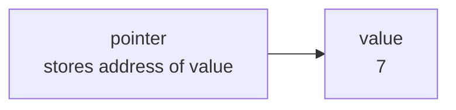

# Week 4 Lecture Notes — Pointers, Lifetime, and Dynamic Memory

> September 29, 2026 · Source lineage: previous pointer, dynamic allocation,
> double-pointer, and linked-data notes plus the instructor-provided
> *From C to Assembly* handout

> Python bridge: [Python Contrast Companion for Week 4](week04_python_companion.md)

## Student route

- **Core:** draw what a pointer designates, distinguish lifetime from scope,
  allocate/resize/free one dynamic array, and state who owns it.
- **Practice:** complete the [Week 4 exercise](lecture_exercises/week04_ex.md)
  before comparing with [the complete example](examples.c).
- **Supporting ideas:** declaration-precedence puzzles, `ptrdiff_t`, function
  pointers, and `qsort` extend the model; they should not replace the central
  address, bounds, lifetime, and ownership reasoning on a first reading.
- **Python bridge:** use the companion for conceptual comparison; Python object
  references are not C pointers.

## Learning objectives

By the end of this lecture, you should be able to:

1. Read declarations involving objects, addresses, and pointers.
2. Distinguish stack duration, dynamic allocation, and object lifetime.
3. Allocate, resize, and free dynamic arrays safely.
4. Identify leaks, dangling pointers, null dereferences, and invalid access.
5. Express ownership and mutation through a function contract.

## Three-hour plan

| Hour | Main question | In-class production |
|------|---------------|---------------------|
| 1 | What exactly does a pointer designate? | Draw stack objects and trace pointer/array expressions |
| 2 | How is dynamic lifetime created and changed? | Implement a failure-aware dynamic integer buffer |
| 3 | How are generic callbacks and multi-level pointers used safely? | Sort records, audit ownership, and repair sanitizer findings |

## Hour 1 — Addresses, indirection, arrays, and `const`

### 1. A pointer stores an address

```c
int value = 7;
int* pointer = &value;

printf("value=%d\n", value);
printf("address=%p\n", (void*)&value);
printf("through pointer=%d\n", *pointer);
```

- `&value` produces the address of `value`.
- `pointer` stores that address.
- `*pointer` designates the object at that address.
- The pointer type describes the pointed-to object and controls pointer arithmetic.



The arrow means “stores the address of,” not “contains a copy of.” Reading
`*pointer` follows the arrow; writing `*pointer = 9` changes the `value` box.

Read `int *pointer` as “pointer is a pointer to int.” In a multi-declaration, the
star belongs to each declarator:

```c
int* first;
int* second;
```

This is clearer than `int *first, second`, where `second` is not a pointer.

You will see both `int *pointer` and `int* pointer`. They declare the same type;
spacing does not change the program. The course formatter writes
`int* pointer`, emphasizing “pointer to int” as the type. That spacing does not
change C's declaration grammar:

```c
int *first, count; /* first is int*, but count is int */
```

Because `count` is still an `int`, not a pointer, do not depend on spacing to
communicate a multi-declaration. One variable per declaration is the clearest
course style:

```c
int* first;
int count;
```

### Initialize structure objects explicitly

Week 3 introduced structures. In C17, a member declaration describes layout;
it cannot contain an initializer. Initialize each object when it is created:

```c
#include <stddef.h>

typedef struct Node {
  int value;
  struct Node* next; /* no "= NULL" here in C17 */
} Node;

Node node = {0, NULL}; /* initialize an object when it is created */
```

Also notice that the body uses `struct Node*`: the typedef name `Node` becomes
available only after the closing brace. For dynamically allocated nodes,
initialization happens after allocation and before another function observes
the node. Week 5 centralizes this work in a node-creation function so every new
node begins with the same valid invariant.

### 2. Pass an address to modify a caller's object

```c
void swap(int* left, int* right) {
  int temporary = *left;
  *left = *right;
  *right = temporary;
}

int main(void) {
  int a = 10;
  int b = 20;
  swap(&a, &b);
}
```

C still passes arguments by value: `left` receives a copy of `&a`. Both the
original address and its copy designate the same integer, so dereferencing the
copy modifies `a`.

### Use `const` to prevent accidental writes

A pointer parameter can promise that the function only reads the array:

```c
int contains_zero(const int* values, size_t count) {
  for (size_t i = 0; i < count; ++i) {
    if (values[i] == 0) return 1;
  }
  return 0;
}
```

Without `const`, a typo such as `values[i] = 0` is a valid assignment and can
silently modify the caller's array. With `const int*`, the compiler rejects
that assignment. `const` is therefore both a contract for the caller and a
safety check for the function author.

<details>
<summary>Optional machine-code preview: forming an address is not accessing an object</summary>

The following comparison is useful after the C pointer model is clear; it is
not required to read or write pointer code.

Consider three different C operations:

```c
int value = 7;
int* pointer = &value; /* form an address */
int copy = *pointer;   /* load through an address */
*pointer = 9;          /* store through an address */
```

On x86, an unoptimized compiler may use `lea` to calculate an effective address
and `mov` with a memory operand to load or store. `lea` does not dereference the
address, and it is also used for ordinary address arithmetic. Conversely, a
memory operand such as `[register]` asks the processor to access memory at the
computed address. Intel and AT&T assembly syntax even write operands in
different orders, so always read the compiler's selected syntax before tracing.

This is a useful model, not a source-level equivalence: `&` and `*` obey C's
type, bounds, alignment, and lifetime rules, while `lea` and `mov` are target
instructions. Optimization may keep `value` only in a register or replace the
whole fragment with a constant, leaving no visible pointer operation.

</details>

### 3. Arrays and pointers are related, not identical

The subscript operation is defined through pointer arithmetic:

```c
values[i] == *(values + i)
```

For this expression, `values` is converted to a pointer to its first element.
This conversion happens in most expressions, which explains why array indexing
and pointer arithmetic are closely related. It does **not** make an array object
and a pointer object the same thing.

But an array object and a pointer object differ:

- `sizeof array` is the storage for all elements in its declaration scope.
- `sizeof pointer` is the storage for one address.
- An array name cannot be assigned a new address.
- A pointer can be advanced or redirected if it is not `const`.

Pointer arithmetic is defined only within one array object (plus its one-past
position). You may form the one-past pointer for loop comparison, but not
dereference it.

### Read declarations from the identifier outward

> **Supporting syntax:** pointer-to-data and pointer-to-const declarations are
> required. Const-pointer and function-pointer forms are recognition material
> here; the later callback section gives the function-pointer form a purpose.

```c
int* p;                    /* pointer to int */
const int* read_only;      /* pointer to const int */
int* const fixed = &value; /* const pointer to int */
const int* const both = &value;
int (*operation)(int, int); /* pointer to function */
```

`const` applies to the item immediately to its left, or to its right when there
is no type on the left. Use typedefs sparingly when they clarify a complicated
callback, but do not use them to avoid learning the underlying type.

### Pointer/array trace

```c
#include <stdio.h>

int values[] = {10, 20, 30, 40};
int* first = values;
int* last = values + 4;

for (int* position = first; position != last; ++position) {
  printf("index=%td value=%d\n", position - first, *position);
}
```

`position - first` is measured in elements and has type `ptrdiff_t`; `%td` is
its matching format. `ptrdiff_t` is designed to hold the difference between two
pointers into the same array. An `int` may be only 32 bits even when pointers are
64 bits, so it is not guaranteed to hold that difference. For the small arrays
used in many programming exercises, an `int` index is often practical; use
`ptrdiff_t` when the value really is a pointer difference. Draw all five valid
pointer positions, including the one-past pointer, and mark which four may be
dereferenced.

### Supporting syntax checkpoint

For each expression, state whether it changes the pointer, the pointed-to value,
both, or neither: `*p++`, `(*p)++`, `*++p`, `++*p`. Then add parentheses that
make the parse explicit. Do this after the basic dereference and array-boundary
trace; these compact forms test precedence but are not preferred introductory
style. Do not run the code until the prediction is written.

## Hour 2 — Lifetime and dynamic storage

### 4. Lifetime is different from scope

```c
int* bad_address(void) {
  int local = 42;
  return &local; /* wrong: local's lifetime ends on return */
}
```

The returned pointer dangles. The variable name is out of scope, and more
importantly the object no longer exists. A valid pointer must designate a live
object (or be a permitted one-past pointer that is never dereferenced).

### 5. Dynamic allocation

Dynamic storage remains allocated until `free` releases it.

`NULL` is the standard null-pointer constant used in C headers. A pointer equal
to `NULL` intentionally designates no object. It may be compared, assigned, or
passed when an interface permits “no object,” but it must never be dereferenced.

```c
#include <stdint.h>
#include <stdio.h>
#include <stdlib.h>

int* read_values(size_t count) {
  if (count > SIZE_MAX / sizeof(int)) return NULL;

  int* values = malloc(count * sizeof(*values));
  if (values == NULL && count != 0) return NULL;

  for (size_t i = 0; i < count; ++i) {
    if (scanf("%d", &values[i]) != 1) {
      free(values);
      return NULL;
    }
  }
  return values;
}
```

At the call site:

```c
int* values = read_values(count);
if (values == NULL && count != 0) {
  fprintf(stderr, "could not read values\n");
  return 1;
}
/* use values */
free(values);
values = NULL;
```

Writing `sizeof(*values)` keeps the allocation correct if the pointed-to type is
changed. Check multiplication before allocation when sizes may be untrusted.

### Build a dynamic buffer incrementally

```c
struct IntBuffer {
  int* data;
  size_t size;
  size_t capacity;
};

int buffer_push(struct IntBuffer* buffer, int value) {
  if (buffer->size == buffer->capacity) {
    size_t next = buffer->capacity == 0 ? 8 : buffer->capacity * 2;
    if (next < buffer->capacity || next > SIZE_MAX / sizeof(*buffer->data)) {
      return 0;
    }
    int* replacement = realloc(buffer->data, next * sizeof(*buffer->data));
    if (replacement == NULL) return 0;
    buffer->data = replacement;
    buffer->capacity = next;
  }
  buffer->data[buffer->size++] = value;
  return 1;
}
```

Invariant: `size <= capacity`; `data == NULL` when capacity is zero; otherwise
`data` designates storage for at least `capacity` integers. On allocation
failure, size, capacity, data, and existing elements remain unchanged.

Finish `buffer_init`, `buffer_clear`, and `buffer_destroy`. Test growth across
the 0→8 and 8→16 boundaries and verify the object can be destroyed after any
failed `push`.

### `calloc` and `realloc`

> **Supporting library detail:** understand the allocate-copy-free effect and
> the failure-safe temporary-pointer pattern. Memorizing every zero-size corner
> case is reference knowledge.

- `calloc(count, size)` allocates and zeroes the bytes.
- `realloc(old, new_size)` may resize in place or move the allocation.

Never overwrite the only pointer before confirming `realloc` succeeded:

```c
if (new_count == 0) {
  free(values);
  values = NULL;
} else {
  if (new_count > SIZE_MAX / sizeof(*values)) {
    handle_failure();
  } else {
    int* resized = realloc(values, new_count * sizeof(*values));
    if (resized == NULL) {
      /* values is still valid */
      handle_failure();
    } else {
      values = resized;
    }
  }
}
```

Handling zero separately avoids the implementation-defined corner cases of
`realloc(pointer, 0)` in C17.

### Lifetime timeline exercise

Draw a timeline for this sequence: declare a buffer, allocate eight elements,
store a borrowed pointer to element three, reallocate to sixteen elements, and
free the buffer. Mark the exact events that may invalidate the borrowed pointer.
`realloc` may move storage even when it succeeds, so every interior pointer must
be considered invalid after a successful resize.

## Hour 3 — Ownership APIs, callbacks, and memory-error diagnosis

### 6. Ownership contracts

For every pointer, ask:

1. May it be null?
2. How many elements are valid?
3. May the callee modify the pointed-to objects?
4. Who owns the allocation?
5. Who must free it, and when?
6. Can another pointer outlive the owner?

As an optional assembly cross-check, compile one safe pointer example and one
returning the address of a local object:

```sh
cc -std=c17 -O0 -S pointer_demo.c
```

`-O0` asks the compiler not to optimize, which usually keeps the generated code
closer to the source. `-S` stops after producing an assembly file rather than an
executable. Identifying an address calculation does not prove that the pointer
remains valid; the lifetime argument must still be made at the C level.

Examples:

```c
void print_values(const int* borrowed, size_t count);
int* values_clone(const int* source, size_t count); /* caller owns result */
void values_destroy(int** owned);                   /* releases and nulls */
```

The double pointer in `values_destroy` lets the function change the caller's
pointer as well as free the allocation:

```c
void values_destroy(int** owned) {
  if (owned == NULL) return;
  free(*owned);
  *owned = NULL;
}
```

### Function pointers and `qsort`

> **Supporting extension:** first secure allocation, ownership, and ordinary
> typed function calls. This section shows why callback types and `void*` exist;
> it is not a prerequisite for the dynamic-array exercise.

The C standard library provides a generic sorting function:

```c
void qsort(void* base, size_t count, size_t element_size,
           int (*compare)(const void*, const void*));
```

`qsort` does not know the element type. The caller supplies the array address,
number of elements, size of one element, and a comparator function. For an
array of student records:

```c
#include <stdlib.h>

struct Student {
  int id;
  double grade;
};

int compare_grade_descending(const void* left, const void* right) {
  const struct Student* a = left;
  const struct Student* b = right;
  return (b->grade > a->grade) - (b->grade < a->grade);
}

qsort(students, count, sizeof(students[0]), compare_grade_descending);
```

The callback borrows two elements as `const void*` and casts them back to the
actual element type. Returning only `-1`, `0`, or `1` avoids overflow errors such
as `return a->id - b->id`. Passing the wrong element size or comparator type
creates undefined behavior that the generic C API cannot detect.
This comparator assumes every grade is finite; a design that permits NaN must
define and implement an explicit total ordering for it.

### Sanitizer triage studio

Run a seeded program containing one each of these actual memory errors:

- read one element beyond a dynamic array;
- use an element pointer after `realloc`;
- free a stack address;
- leak on an early return;
- dereference a null output parameter.

For every report, record the invalid operation, where the affected allocation
was created/released, and the ownership rule that would have prevented it. Fix
the contract or control flow, not only the single reported line.

Then call the `values_destroy` implementation above twice with the same owning
pointer. This is a **safety check**, not a seeded error: the first call sets the
owner to `NULL`, and the second call reaches `free(NULL)`, which is defined to do
nothing. Confirm that the sanitizer emits no report. Contrast this behavior with
a destroy function that frees the allocation but leaves the caller's pointer
dangling.

### 7. Failure patterns

| Failure | Meaning |
|---------|---------|
| Leak | The last usable pointer is lost before `free` |
| Dangling pointer | The pointer remains after the object's lifetime ends |
| Double free | The same allocation is released more than once |
| Invalid free | `free` receives an address not returned by allocation |
| Null dereference | `*pointer` is evaluated when `pointer == NULL` |
| Buffer overflow | Access goes before or beyond an allocation |

Compile memory-sensitive work with sanitizers:

```sh
cc -std=c17 -Wall -Wextra -Wpedantic -g \
  -fsanitize=address,undefined program.c -o program
```

Sanitizers do not prove correctness, but they turn many silent errors into a
report close to the failing operation.

## Midterm project connection — Ownership is part of correctness

Create an ownership table for the compiler scaffold. Include the token list,
token array if present, AST nodes, and any temporary buffers. For each resource,
record its creator, owner, borrowers, successful release, and error-path
release. Then trace three cases: valid input, invalid syntax after partial AST
construction, and a semantic failure after parsing.

An LLM can propose likely owners, but it cannot infer the contract reliably
from a partial snippet. Check call sites and cleanup code, run a small case under
AddressSanitizer, and reject any suggested repair that merely suppresses a
report without restoring the ownership rule.

## Check yourself

1. Draw the objects and arrows after `int x = 3; int* p = &x;`.
2. Why is returning `&local` invalid but returning a `malloc` result possible?
3. What is the difference between `const int* p` and `int* const p`?
4. Write the ownership contract for `read_values`.
5. Explain why `values = realloc(values, bytes)` can leak memory.

## Summary

- A pointer is a typed address; dereferencing designates the pointed-to object.
- Valid access requires correct bounds, alignment, type, and lifetime.
- Dynamic allocation makes lifetime explicit and therefore makes ownership vital.
- Every successful allocation needs one eventual release on every path.
- Pointer contracts should state nullability, size, mutability, and ownership.

## References and source materials

- [Instructor handout: *From C to Assembly*](../../assets/references/from_c_to_assembly.pdf)
- [Instructor slides: *Assembly*](../../assets/references/lee_assembly.pptx)
- [Pointers](<https://github.com/htchen/i2p-nthu/blob/master/程式設計一/pointer/Pointer.md>)
- [Supplementary C material: memory and pointers](<https://github.com/htchen/i2p-nthu/blob/master/程式設計一/Supplementary%20Material%201/README.md>)
- [2025 Week 1 notebook: linked-list foundations (Colab)](https://colab.research.google.com/drive/1Asu-XpzM8EfrB8ANf4ze4ejDUdgIFGq0)
