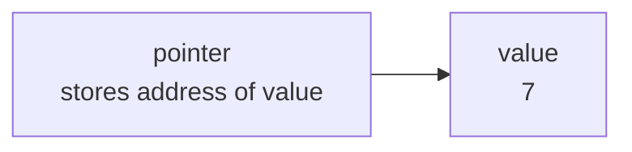
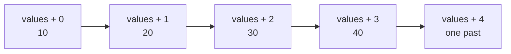
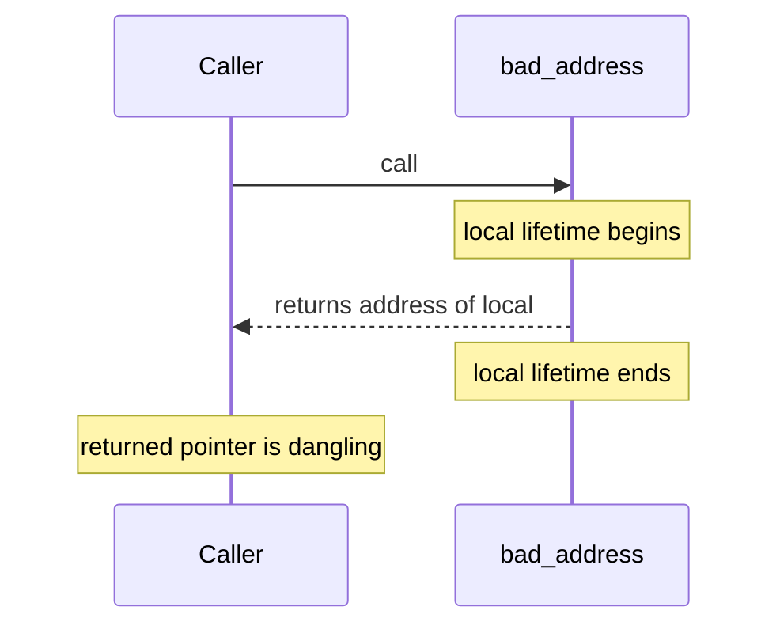
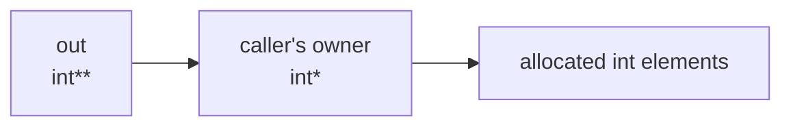
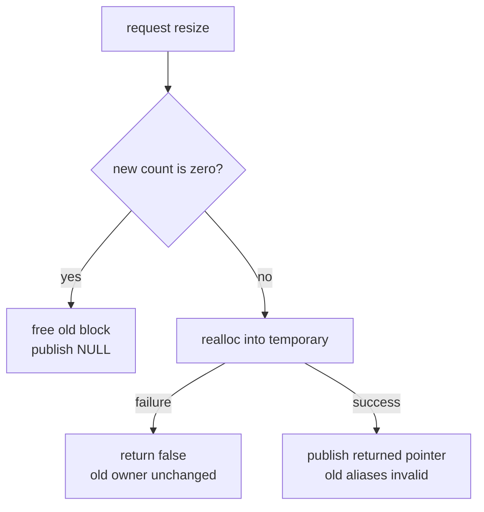

# Week 4 Lecture Notes — Pointers, Lifetime, and Dynamic Memory

> September 29, 2026 · Source lineage: previous pointer, dynamic allocation,
> double-pointer, and linked-data notes plus the instructor-provided
> *From C to Assembly* handout

> Python bridge: [Python Contrast Companion for Week 4](week04_python_companion.md)

---

## Student route

- **Core:** draw what a pointer designates, distinguish lifetime from scope,
  allocate/resize/free one dynamic array, and state who owns it.
- **Practice:** complete the [Week 4 exercise](lecture_exercises/week04_ex.md)
  before comparing with [the complete example](examples.c).
- **Supporting ideas:** declaration-precedence puzzles, `ptrdiff_t`, function
  pointers, and `qsort` extend the model; they should not replace the central
  address, bounds, lifetime, and ownership reasoning on a first reading.
- **Python bridge:** use the companion for conceptual comparison; Python object
  references are not C pointers.

---

## Learning objectives

By the end of this lecture, you should be able to:

1. Read declarations involving objects, addresses, and pointers.
2. Distinguish automatic storage duration, allocated storage duration, scope,
   and object lifetime.
3. Allocate, resize, and free dynamic arrays safely.
4. Identify leaks, dangling pointers, null dereferences, and invalid access.
5. Express ownership and mutation through a function contract.

---

## Three-hour plan

| Hour | Main question | In-class production |
|------|---------------|---------------------|
| 1 | What exactly does a pointer designate? | Draw automatic-duration objects and trace pointer/array expressions |
| 2 | How is dynamic lifetime created and changed? | Implement a failure-aware dynamic integer buffer |
| 3 | How do ownership APIs and generic callbacks remain safe? | Sort records, audit ownership, and repair sanitizer findings |

Each hour interleaves about 35–45 minutes of explanation and live coding with
roughly 15–20 minutes of core practice. The remaining time supports questions,
transitions, and a short break. Exercises labelled **Extension** can move to the
lab or independent study when the class needs more time on the core pointer and
ownership model.

### Inline practice routine

Each **Try it now** activity follows the same short cycle used in Weeks 1–3:

1. draw the relevant objects, addresses, valid ranges, and ownership arrows;
2. predict the value, state change, output, or diagnostic;
3. write or edit the smallest complete C17 example;
4. compile with `-std=c17 -Wall -Wextra -Wpedantic` and run only valid cases;
5. explain which bounds, lifetime, or ownership rule justifies the result.

Only the question is initially visible. Expand **Reveal solution** after making
and checking an attempt. Each solution gives expected output, a memory trace, a
diagnostic category, or an explanation of why intentionally invalid code must
not be executed.

- **Core live:** part of the planned in-class route.
- **Extension:** additional practice for the lab, a break, or later study.

The core-live exercises total about 18 minutes in Hour 1, 20 minutes in Hour 2,
and 18 minutes in Hour 3.

---

## Hour 1 — Addresses, indirection, arrays, and `const`

> **Hour 1 route:** [A pointer stores an address](#1-a-pointer-stores-an-address)
> → [Initialize structure objects explicitly](#initialize-structure-objects-explicitly)
> → [Pass an address to modify a caller's object](#2-pass-an-address-to-modify-a-callers-object)
> → [Use `const` to prevent accidental writes](#use-const-to-prevent-accidental-writes)
> → [Arrays and pointers are related, not identical](#3-arrays-and-pointers-are-related-not-identical)
> → [Return a borrowed element pointer](#return-a-borrowed-element-pointer)
> → [Read declarations from the identifier outward](#read-declarations-from-the-identifier-outward)
> → [Pointer/array trace](#pointerarray-trace)
> → [Supporting syntax checkpoint](#supporting-syntax-checkpoint)

### 1. A pointer stores an address

```c
#include <stdio.h>

int main(void) {
  int value = 7;
  int* pointer = &value;

  printf("value=%d\n", value);
  printf("address=%p\n", (void*)&value);
  printf("through pointer=%d\n", *pointer);
  return 0;
}
```

- `&value` produces the address of `value`.
- `pointer` stores that address.
- `*pointer` designates the object at that address.
- The pointer type describes the pointed-to object and controls pointer arithmetic.


```mermaid
flowchart LR
    pointer["pointer<br/>stores address of value"] --> value["value<br/>7"]
```

The arrow means “stores the address of,” not “contains a copy of.” Reading
`*pointer` follows the arrow; writing `*pointer = 9` changes the `value` box.

The first and third lines are deterministic; the address text is selected by
the implementation and may change between executions:

```text
value=7
address=<implementation-selected address>
through pointer=7
```

Read `int *pointer` as “pointer is a pointer to int.” In a multi-declaration, the
star belongs to each declarator:

```c
int* first;
int* second;
```

This is clearer than `int *first, second`, where `second` is not a pointer.

You will see both `int *pointer` and `int* pointer`. They declare the same type;
spacing does not change the program. The course formatter writes
`int* pointer`, emphasizing “pointer to int” as the type. That spacing does not
change C's declaration grammar:

```c
int *first, count; /* first is int*, but count is int */
```

Because `count` is still an `int`, not a pointer, do not depend on spacing to
communicate a multi-declaration. One variable per declaration is the clearest
course style:

```c
int* first;
int count;
```

#### Try it now [Core live] — change an object through its address (3 minutes)

Starting from the complete program above, execute `*pointer = 9`, then print
both `value` and `*pointer`. Draw the two named objects before predicting the
output. How many `int` objects exist?

<details>
<summary>Reveal solution</summary>

Add these statements before `return 0`:

```c
*pointer = 9;
printf("value=%d through-pointer=%d\n", value, *pointer);
```

**Expected added output:**

```text
value=9 through-pointer=9
```

There is one `int` object, named `value`, and one pointer object, named
`pointer`. Dereferencing the pointer designates the existing integer; it does
not create a second integer.

</details>

---

### Initialize structure objects explicitly

Week 3 introduced structures. In C17, a member declaration describes layout;
it cannot contain an initializer. Initialize each object when it is created:

```c
#include <stddef.h>

typedef struct Node {
  int value;
  struct Node* next; /* no "= NULL" here in C17 */
} Node;

Node node = {0, NULL}; /* initialize an object when it is created */
```

Also notice that the body uses `struct Node*`: the typedef name `Node` becomes
available only after the closing brace. For dynamically allocated nodes,
initialization happens after allocation and before another function observes
the node. Week 5 centralizes this work in a node-creation function so every new
node begins with the same valid invariant.

#### Try it now [Extension] — separate a type from an initialized object (2 minutes)

Why is `struct Node* next = NULL;` invalid inside the structure body in C17,
while `Node node = {0, NULL};` is valid after the type definition? Change the
object initializer to a designated initializer.

<details>
<summary>Reveal solution</summary>

A structure body contains member declarations, not construction statements or
per-object default values. The object declaration is where storage is created
and initialized:

```c
Node node = {.value = 0, .next = NULL};
```

This declaration produces no run-time output. Both members have explicit values
before another function observes the object.

</details>

---

### 2. Pass an address to modify a caller's object

Week 2 used this pattern as an operational bridge. We can now state the complete
pointer contract: both parameters must designate live, writable `int` objects
for the duration of the call. They may designate the same object; the body must
still remain valid in that case.

```c
#include <stdio.h>

void swap(int* left, int* right) {
  int temporary = *left;
  *left = *right;
  *right = temporary;
}

int main(void) {
  int a = 10;
  int b = 20;
  swap(&a, &b);
  printf("a=%d b=%d\n", a, b);
  return 0;
}
```

C still passes arguments by value: `left` receives a copy of `&a`. Both the
original address and its copy designate the same integer, so dereferencing the
copy modifies `a`.

**Expected output:**

```text
a=20 b=10
```

#### Try it now [Core live] — trace an aliased call (3 minutes)

After the first call, add `swap(&a, &a)`. Predict whether the function violates
its contract and what the next printed value of `a` will be.

<details>
<summary>Reveal solution</summary>

Both parameters designate the same live, writable object. The assignments read
and write that one object but leave its value unchanged:

```c
swap(&a, &a);
printf("a=%d\n", a);
```

**Expected added output:**

```text
a=20
```

This implementation permits aliasing. A different function may require two
non-overlapping ranges; that restriction would have to appear in its contract.

</details>

---

### Use `const` to prevent accidental writes

A pointer parameter can promise that the function only reads the array:

```c
#include <stdbool.h>
#include <stddef.h>
#include <stdio.h>

bool contains_zero(const int* values, size_t count) {
  for (size_t i = 0; i < count; ++i) {
    if (values[i] == 0) {
      return true;
    }
  }
  return false;
}

int main(void) {
  const int values[] = {4, 0, 7};
  printf("contains-zero=%d\n", contains_zero(values, 3));
  return 0;
}
```

Without `const`, a typo such as `values[i] = 0` is a valid assignment and can
silently modify the caller's array. With `const int*`, the compiler rejects
that assignment. `const` is therefore both a contract for the caller and a
safety check for the function author.

**Expected output:**

```text
contains-zero=1
```

#### Try it now [Core live] — let `const` catch an assignment typo (2 minutes)

Temporarily change `==` in the `if` condition to `=`. Compile but do not run.
Classify the result, then restore the comparison.

<details>
<summary>Reveal solution</summary>

The attempted statement is equivalent to assigning through a pointer-to-const:

```c
values[i] = 0;
```

Compilation must issue a diagnostic because this access path does not permit
modification. No executable output should be requested from the rejected
program. Exact wording varies, but it should identify assignment to a read-only
location or object.

</details>

<details>
<summary>Optional machine-code preview: forming an address is not accessing an object</summary>

The following comparison is useful after the C pointer model is clear; it is
not required to read or write pointer code.

Consider three different C operations:

```c
int value = 7;
int* pointer = &value; /* form an address */
int copy = *pointer;   /* load through an address */
*pointer = 9;          /* store through an address */
```

On x86, an unoptimized compiler may use `lea` to calculate an effective address
and `mov` with a memory operand to load or store. `lea` does not dereference the
address, and it is also used for ordinary address arithmetic. Conversely, a
memory operand such as `[register]` asks the processor to access memory at the
computed address. Intel and AT&T assembly syntax even write operands in
different orders, so always read the compiler's selected syntax before tracing.

This is a useful model, not a source-level equivalence: `&` and `*` obey C's
type, bounds, alignment, and lifetime rules, while `lea` and `mov` are target
instructions. Optimization may keep `value` only in a register or replace the
whole fragment with a constant, leaving no visible pointer operation.

</details>

---

### 3. Arrays and pointers are related, not identical

The subscript operation is defined through pointer arithmetic:

```c
values[i] == *(values + i)
```

For this expression, `values` is converted to a pointer to its first element.
This conversion happens in most expressions, which explains why array indexing
and pointer arithmetic are closely related. It does **not** make an array object
and a pointer object the same thing.

But an array object and a pointer object differ:

- `sizeof array` is the storage for all elements in its declaration scope.
- `sizeof pointer` is the storage for one address.
- An array name cannot be assigned a new address.
- A pointer can be advanced or redirected if it is not `const`.

Pointer arithmetic is defined only within one array object (plus its one-past
position). You may form the one-past pointer for loop comparison, but not
dereference it.


```mermaid
flowchart LR
    p0["values + 0<br/>10"] --> p1["values + 1<br/>20"]
    p1 --> p2["values + 2<br/>30"]
    p2 --> p3["values + 3<br/>40"]
    p3 --> past["values + 4<br/>one past"]
```

The arrows in this picture mean “advance by one element.” The first four
positions designate elements. The fifth may be formed and compared but not
dereferenced.

#### Try it now [Core live] — distinguish an array from a pointer (3 minutes)

Given `int values[4] = {10, 20, 30, 40};` and `int* pointer = values`, decide
which expressions can recover the four-element count: `sizeof(values) /
sizeof(values[0])` or `sizeof(pointer) / sizeof(pointer[0])`. Explain why before
compiling.

<details>
<summary>Reveal solution</summary>

Within the block that declares the array, this expression produces four:

```c
size_t count = sizeof(values) / sizeof(values[0]);
printf("count=%zu\n", count);
```

**Expected output:**

```text
count=4
```

`sizeof(pointer)` measures the pointer object, not the array. Its quotient by
`sizeof(pointer[0])` is implementation-dependent and is not an element count.
The same limitation applies to an array parameter because it is adjusted to a
pointer parameter.

</details>

---

### Return a borrowed element pointer

Week 2 previewed a search interface that returns either an element pointer or
`NULL`. Its complete lifetime contract is now visible:

```c
#include <stddef.h>

const int* find_element(const int values[], size_t count, int target) {
  for (size_t i = 0; i < count; ++i) {
    if (values[i] == target) {
      return &values[i];
    }
  }
  return NULL;
}
```

The returned pointer is borrowed. It remains usable only while the caller's
array is alive and has not been released or relocated. The function does not
transfer ownership, and the caller must not pass the returned interior pointer
to `free`.

#### Try it now [Core live] — preserve a returned pointer's lifetime (3 minutes)

Call `find_element` on `{4, 7, 9}` for targets `7` and `8`. Check for `NULL`
before dereferencing and print the results. Who owns the array?

<details>
<summary>Reveal solution</summary>

```c
#include <stdio.h>

int main(void) {
  const int values[] = {4, 7, 9};
  const int* found = find_element(values, 3, 7);
  if (found != NULL) {
    printf("found=%d\n", *found);
  }
  found = find_element(values, 3, 8);
  printf("missing=%d\n", found == NULL);
  return 0;
}
```

**Expected output:**

```text
found=7
missing=1
```

`main` owns the automatic-duration array. The search function and returned
pointer only borrow its elements.

</details>

---

### Read declarations from the identifier outward

> **Supporting syntax:** pointer-to-data and pointer-to-const declarations are
> required. Const-pointer and function-pointer forms are recognition material
> here; the later callback section gives the function-pointer form a purpose.

```c
int value = 0;
int* p;                    /* pointer to int */
const int* read_only;      /* pointer to const int */
int* const fixed = &value; /* const pointer to int */
const int* const both = &value;
int (*operation)(int, int); /* pointer to function */
```

`const` applies to the item immediately to its left, or to its right when there
is no type on the left. Use typedefs sparingly when they clarify a complicated
callback, but do not use them to avoid learning the underlying type.

#### Try it now [Extension] — classify two kinds of `const` (3 minutes)

For `const int* read_only` and `int* const fixed`, decide separately whether the
pointer may be redirected and whether the pointed-to integer may be changed
through that pointer.

<details>
<summary>Reveal solution</summary>

| Declaration | Redirect pointer? | Write through pointer? |
|-------------|-------------------|------------------------|
| `const int* read_only` | yes | no |
| `int* const fixed` | no | yes |
| `const int* const both` | no | no |

This is a type-classification exercise, so it has no run-time output. Attempting
a forbidden assignment requires a compile-time diagnostic.

</details>

---

### Pointer/array trace

```c
#include <stddef.h>
#include <stdio.h>

int main(void) {
  int values[] = {10, 20, 30, 40};
  int* first = values;
  int* last = values + 4;

  for (int* position = first; position != last; ++position) {
    printf("index=%td value=%d\n", position - first, *position);
  }
  return 0;
}
```

`position - first` is measured in elements and has type `ptrdiff_t`; `%td` is
its matching format. `ptrdiff_t` is designed to hold the difference between two
pointers into the same array. An `int` may be only 32 bits even when pointers are
64 bits, so it is not guaranteed to hold that difference. For the small arrays
used in many programming exercises, an `int` index is often practical; use
`ptrdiff_t` when the value really is a pointer difference. `<stddef.h>` declares
the type name when code needs to spell it explicitly.

**Expected output:**

```text
index=0 value=10
index=1 value=20
index=2 value=30
index=3 value=40
```

#### Try it now [Core live] — trace the one-past boundary (4 minutes)

Draw all five pointer positions from `values` through `values + 4`. For each,
record the result of subtracting `first` and whether dereferencing is permitted.
Then change the loop condition to `position <= last`; predict the invalid
operation, but do not run that changed version.

<details>
<summary>Reveal solution</summary>

| Pointer | Difference from `first` | May dereference? |
|---------|-------------------------|------------------|
| `values + 0` | 0 | yes |
| `values + 1` | 1 | yes |
| `values + 2` | 2 | yes |
| `values + 3` | 3 | yes |
| `values + 4` | 4 | no; one past |

With `<=`, the last iteration evaluates `*position` when `position == last`.
That out-of-bounds access has undefined behavior, so the intentionally broken
version has no defined output and must not be used as a normal test.

</details>

---

### Supporting syntax checkpoint

#### Try it now [Extension] — make pointer precedence explicit (4 minutes)

For each expression, state whether it changes the pointer, the pointed-to value,
both, or neither: `*p++`, `(*p)++`, `*++p`, `++*p`. Then add parentheses that
make the parse explicit. Do this after the basic dereference and array-boundary
trace; these compact forms test precedence but are not preferred introductory
style. Do not run the code until the prediction is written.

<details>
<summary>Reveal solution</summary>

| Expression | Explicit parse | Effect |
|------------|----------------|--------|
| `*p++` | `*(p++)` | use the current pointed-to value, then advance `p` |
| `(*p)++` | `(*p)++` | use then increment the pointed-to value |
| `*++p` | `*(++p)` | advance `p`, then use the newly pointed-to value |
| `++*p` | `++(*p)` | increment then use the pointed-to value |

The table gives syntax and sequencing, not permission to access arbitrary
storage. Every dereference still requires a live in-bounds object, and every
write requires a modifiable object. There is no single output without a
specific initial pointer and array.

</details>

---

## Hour 2 — Lifetime and dynamic storage

> **Hour 2 route:** [Lifetime is different from scope](#4-lifetime-is-different-from-scope)
> → [Dynamic allocation](#5-dynamic-allocation)
> → [Publish ownership through a double pointer](#publish-ownership-through-a-double-pointer)
> → [Build a dynamic buffer incrementally](#build-a-dynamic-buffer-incrementally)
> → [`calloc` and `realloc`](#calloc-and-realloc)
> → [Lifetime timeline exercise](#lifetime-timeline-exercise)

### 4. Lifetime is different from scope

Week 1 introduced C's standard storage-duration terms. An ordinary block-local
object has **automatic storage duration**: its lifetime normally begins when
execution enters its block and ends when execution leaves. Implementations
commonly place such objects on a call stack, but “stack duration” is not a C
language category. Storage obtained from `malloc` has **allocated storage
duration** and remains live until a deallocation operation ends it.

```c
int* bad_address(void) {
  int local = 42;
  return &local; /* wrong: local's lifetime ends on return */
}
```

The returned pointer dangles. The variable name is out of scope, and more
importantly the object no longer exists. A valid pointer must designate a live
object (or be a permitted one-past pointer that is never dereferenced).


```mermaid
sequenceDiagram
    participant Caller
    participant bad_address
    Caller->>bad_address: call
    Note over bad_address: local lifetime begins
    bad_address-->>Caller: returns address of local
    Note over bad_address: local lifetime ends
    Note over Caller: returned pointer is dangling
```

#### Try it now [Core live] — separate scope from lifetime (3 minutes)

Classify each returned result: an integer copied from a local variable, the
address of a local variable, and a successfully allocated pointer. State which
result the caller owns and which invalid case must not be dereferenced.

<details>
<summary>Reveal solution</summary>

| Returned result | Valid after return? | Reason |
|-----------------|---------------------|--------|
| copied `int` value | yes | the result value is copied before the local object ends |
| `&local` | no | the automatic-duration object has ended; the pointer dangles |
| successful `malloc` result | yes | allocated lifetime continues until deallocation |

The caller normally becomes the owner of the successful allocation and must
eventually release it. The `&local` case has no defined run-time output after a
dereference; diagnosing the warning and lifetime error is the exercise.

</details>

---

### 5. Dynamic allocation

Storage returned by `malloc` is suitably aligned for ordinary object types but
its bytes are uninitialized. Read an element only after the program has stored
a value there. In C, do not cast the result of `malloc`; including `<stdlib.h>`
provides the required declaration and `void*` converts to an object-pointer type.

The successful caller owns the allocation until ownership is transferred or
`free` releases it. `free` does not set any pointer to `NULL`, and clearing one
owner variable does not clear other aliases. Those aliases become dangling when
the allocation's lifetime ends.

`NULL` is the standard null-pointer constant used in C headers. A pointer equal
to `NULL` intentionally designates no object. It may be compared, assigned, or
passed when an interface permits “no object,” but it must never be dereferenced.

```c
#include <stdint.h>
#include <stdio.h>
#include <stdlib.h>

int* read_values(size_t count) {
  if (count > SIZE_MAX / sizeof(int)) return NULL;

  int* values = malloc(count * sizeof(*values));
  if (values == NULL && count != 0) return NULL;

  for (size_t i = 0; i < count; ++i) {
    if (scanf("%d", &values[i]) != 1) {
      free(values);
      return NULL;
    }
  }
  return values;
}
```

At the call site:

```c
int main(void) {
  const size_t count = 3;
  int* values = read_values(count);
  if (values == NULL) {
    fputs("could not read three values\n", stderr);
    return 1;
  }
  for (size_t i = 0; i < count; ++i) {
    printf("value[%zu]=%d\n", i, values[i]);
  }
  free(values);
  values = NULL;
  return 0;
}
```

Writing `sizeof(*values)` keeps the allocation correct if the pointed-to type is
changed. Check multiplication before allocation when sizes may be untrusted.
For count zero, C permits `malloc(0)` to return either `NULL` or a pointer that
may later be passed to `free`; an interface must document how it represents an
empty successful result. The next constructor chooses exactly one
representation: an empty sequence has a `NULL` owner.

#### Try it now [Core live] — trace allocation, initialization, and release (4 minutes)

Compile the program and provide `4 8 15` as input. Predict the output and draw
the owner before allocation, after the three stores, and after `free`. Then
classify input `4 x 15`: does a partial allocation escape to `main`?

<details>
<summary>Reveal solution</summary>

For valid input, the program prints:

```text
value[0]=4
value[1]=8
value[2]=15
```

The owner trace is:

```text
before read_values: no allocation owned by main
after return:        values -> [4, 8, 15]
after free:          allocation ended; values is then set to NULL
```

For `4 x 15`, the second conversion fails. `read_values` releases the candidate
block and returns `NULL`, so no partial array becomes owned by `main`. The
program writes the diagnostic to standard error and returns a nonzero status.

</details>

---

### Publish ownership through a double pointer

Returning only a pointer cannot distinguish an empty successful sequence from
failure when both use `NULL`. A Boolean status plus an output parameter keeps
those results separate. The output parameter has type `int**` because it stores
the address of the caller's owning `int*`:

```c
#include <stdbool.h>
#include <stdint.h>
#include <stdlib.h>

bool make_sequence(size_t size, int** out) {
  if (out == NULL || *out != NULL || size > SIZE_MAX / sizeof(int)) {
    return false;
  }
  int* candidate = NULL;
  if (size > 0) {
    candidate = malloc(size * sizeof(*candidate));
    if (candidate == NULL) {
      return false;
    }
    for (size_t i = 0; i < size; ++i) {
      candidate[i] = 0;
    }
  }
  *out = candidate;
  return true;
}
```

Contract:

- `out` designates a live, writable, initialized owning pointer;
- `*out` must initially be `NULL`, so construction cannot overwrite and leak an
  existing allocation;
- success publishes either `NULL` for size zero or an owned zero-initialized
  block for positive size; and
- failure leaves the owner unchanged.


```mermaid
flowchart LR
    out["out<br/>int**"] --> owner["caller's owner<br/>int*"]
    owner --> block["allocated int elements"]
```

`*out` is the caller's pointer object; `**out` would be its first integer when a
nonempty block exists.

#### Try it now [Core live] — trace two levels of indirection (5 minutes)

Start with `int* values = NULL`. Trace `make_sequence(3, &values)`,
`make_sequence(0, &empty)`, and `make_sequence(2, NULL)`. Record the Boolean
result, final owner, and cleanup responsibility. Why does the contract reject a
non-`NULL` initial owner?

<details>
<summary>Reveal solution</summary>

| Call | Status | Published owner | Responsibility |
|------|--------|-----------------|----------------|
| size 3 with `&values` | `true` if allocation succeeds | block containing `0, 0, 0` | caller must `free(values)` |
| size 0 with `&empty` | `true` | `NULL` | no allocation to release |
| size 2 with `NULL` output | `false` | none | no allocation escapes |

Overwriting a non-`NULL` owner could discard the only pointer to its existing
allocation and cause a leak. Requiring an initialized empty owner makes the
construction transaction explicit. Allocation failure is environment-dependent;
on that path the owner remains `NULL` and there is no standard output.

</details>

---

### Build a dynamic buffer incrementally

```c
#include <stdbool.h>
#include <stdint.h>
#include <stdlib.h>

struct IntBuffer {
  int* data;
  size_t size;
  size_t capacity;
};

void buffer_init(struct IntBuffer* buffer) {
  buffer->data = NULL;
  buffer->size = 0;
  buffer->capacity = 0;
}

bool buffer_push(struct IntBuffer* buffer, int value) {
  if (buffer == NULL || buffer->size > buffer->capacity ||
      (buffer->capacity == 0) != (buffer->data == NULL)) {
    return false;
  }
  if (buffer->size == buffer->capacity) {
    size_t next = 8;
    if (buffer->capacity > 0) {
      if (buffer->capacity > SIZE_MAX / 2) {
        return false;
      }
      next = buffer->capacity * 2;
    }
    if (next > SIZE_MAX / sizeof(*buffer->data)) {
      return false;
    }
    int* replacement = realloc(buffer->data, next * sizeof(*buffer->data));
    if (replacement == NULL) {
      return false;
    }
    buffer->data = replacement;
    buffer->capacity = next;
  }
  buffer->data[buffer->size++] = value;
  return true;
}

void buffer_clear(struct IntBuffer* buffer) {
  if (buffer != NULL) {
    buffer->size = 0;
  }
}

void buffer_destroy(struct IntBuffer* buffer) {
  if (buffer == NULL) {
    return;
  }
  free(buffer->data);
  buffer->data = NULL;
  buffer->size = 0;
  buffer->capacity = 0;
}
```

Invariant: `size <= capacity`; `data == NULL` when capacity is zero; otherwise
`data` designates storage for at least `capacity` integers. On allocation
failure, size, capacity, data, and existing elements remain unchanged.

`buffer_clear` removes the logical elements but deliberately retains capacity
for reuse. `buffer_destroy` releases the allocation and restores the same empty
state established by `buffer_init`. The `buffer_push` contract requires an
initialized buffer; its defensive invariant checks catch several caller errors
but cannot prove that an arbitrary non-null pointer owns a live allocation.

#### Try it now [Core live] — cross two growth boundaries (5 minutes)

Initialize a buffer, push integers 1 through 9, and print its size, capacity,
first value, and last value. Then clear, push 42, destroy, and draw the state
after each operation.

<details>
<summary>Reveal solution</summary>

```c
#include <stdio.h>

int main(void) {
  struct IntBuffer buffer;
  buffer_init(&buffer);
  for (int value = 1; value <= 9; ++value) {
    if (!buffer_push(&buffer, value)) {
      buffer_destroy(&buffer);
      return 1;
    }
  }
  printf("size=%zu capacity=%zu first=%d last=%d\n", buffer.size,
         buffer.capacity, buffer.data[0], buffer.data[8]);

  buffer_clear(&buffer);
  if (!buffer_push(&buffer, 42)) {
    buffer_destroy(&buffer);
    return 1;
  }
  printf("after-clear size=%zu capacity=%zu value=%d\n", buffer.size,
         buffer.capacity, buffer.data[0]);
  buffer_destroy(&buffer);
  printf("destroyed size=%zu capacity=%zu null=%d\n", buffer.size,
         buffer.capacity, buffer.data == NULL);
  return 0;
}
```

**Expected output:**

```text
size=9 capacity=16 first=1 last=9
after-clear size=1 capacity=16 value=42
destroyed size=0 capacity=0 null=1
```

The ninth insertion crosses the 8→16 boundary. Clearing retains that capacity;
destruction releases it.

</details>

---

### `calloc` and `realloc`

> **Supporting library detail:** understand the allocate-copy-free effect and
> the failure-safe temporary-pointer pattern. Memorizing every zero-size corner
> case is reference knowledge.

- `calloc(count, size)` allocates and zeroes the bytes.
- `realloc(old, new_size)` may resize in place or move the allocation.

For an integer array, the all-zero bytes produced by `calloc` represent integer
zero. Do not generalize that statement to every possible C type: an all-bits-zero
object representation is not promised to be a null pointer representation.

Never overwrite the only pointer before confirming `realloc` succeeded:

```c
#include <stdbool.h>
#include <stdint.h>
#include <stdlib.h>

bool resize_int_block(int** owner, size_t new_count) {
  if (owner == NULL || new_count > SIZE_MAX / sizeof(**owner)) {
    return false;
  }
  if (new_count == 0) {
    free(*owner);
    *owner = NULL;
    return true;
  }

  int* candidate = realloc(*owner, new_count * sizeof(*candidate));
  if (candidate == NULL) {
    return false;
  }
  *owner = candidate;
  return true;
}
```

The temporary `candidate` makes the operation transactional. Failure leaves
`*owner` unchanged; success publishes the only pointer that should be used for
the resized allocation. This minimal helper does not initialize newly added
elements because it does not receive the old element count. The lecture
exercise's `resize_sequence` adds that contract.


```mermaid
flowchart TD
    call["request resize"] --> zero{"new count is zero?"}
    zero -->|yes| release["free old block<br/>publish NULL"]
    zero -->|no| attempt["realloc into temporary"]
    attempt -->|failure| preserve["return false<br/>old owner unchanged"]
    attempt -->|success| publish["publish returned pointer<br/>old aliases invalid"]
```

Handling zero separately avoids the implementation-defined corner cases of
`realloc(pointer, 0)` in C17.

#### Try it now [Extension] — preserve ownership on failure (4 minutes)

Explain why replacing the temporary-pointer pattern with
`*owner = realloc(*owner, bytes)` can leak. For success that moves the block,
classify the old owner value and every pointer into the old block.

<details>
<summary>Reveal solution</summary>

If `realloc` returns `NULL`, direct assignment overwrites the only pointer to the
still-live old allocation. That allocation can no longer be released: it is
leaked. With a temporary, the old owner remains available on failure.

On success, the old allocation's lifetime ends even when the returned address
looks numerically unchanged. The returned pointer becomes the owner; old owner
copies and interior element pointers must not be used. This reasoning trace has
no program output because allocation success, failure, and movement are not
deterministic events to demand from one ordinary run.

</details>

---

### Lifetime timeline exercise

Draw a timeline for this sequence: declare a buffer, allocate eight elements,
store a borrowed pointer to element three, reallocate to sixteen elements, and
free the buffer. Mark the exact events that may invalidate the borrowed pointer.
`realloc` may move storage even when it succeeds, so every interior pointer must
be considered invalid after a successful resize.

#### Try it now [Core live] — mark every lifetime boundary (3 minutes)

Complete the timeline before expanding the solution. At which operation must a
fresh pointer to element three be computed, and what happens to that fresh
pointer after destruction?

<details>
<summary>Reveal solution</summary>

```text
initialized empty buffer: no element pointer exists
allocate 8:              owner -> live block; element pointer may be formed
successful realloc 16:   old block ends; old element pointer is invalid
after publishing result: owner -> resized block; recompute owner + 3
destroy:                 resized block ends; recomputed pointer dangles
```

The element pointer must be recomputed from the published `realloc` result. It
becomes dangling when `buffer_destroy` frees the allocation. Setting the owner
to `NULL` does not modify this separate borrowed pointer.

</details>

---

## Hour 3 — Ownership APIs, callbacks, and memory-error diagnosis

> **Hour 3 route:** [Ownership contracts](#6-ownership-contracts)
> → [Opaque ownership revisited](#opaque-ownership-revisited)
> → [Function pointers and `qsort`](#function-pointers-and-qsort)
> → [Sanitizer triage studio](#sanitizer-triage-studio)
> → [Failure patterns](#7-failure-patterns)
> → [project ownership audit](#midterm-project-connection--ownership-is-part-of-correctness)

### 6. Ownership contracts

For every pointer, ask:

1. May it be null?
2. How many elements are valid?
3. May the callee modify the pointed-to objects?
4. Who owns the allocation?
5. Who must free it, and when?
6. Can another pointer outlive the owner?

As an optional assembly cross-check, compile one safe pointer example and one
returning the address of a local object:

```sh
cc -std=c17 -O0 -S pointer_demo.c
```

`-O0` asks the compiler not to optimize, which usually keeps the generated code
closer to the source. `-S` stops after producing an assembly file rather than an
executable. Identifying an address calculation does not prove that the pointer
remains valid; the lifetime argument must still be made at the C level.

Examples:

```c
#include <stdbool.h>
#include <stddef.h>

void print_values(const int* borrowed, size_t count);
bool values_clone(const int* source, size_t count, int** out);
void values_destroy(int** owner);
```

- `print_values` borrows a readable range and neither stores nor frees it.
- `values_clone` requires an initialized empty output owner and publishes an
  independent owned copy only on success.
- `values_destroy` accepts the address of an owner that is either `NULL` or
  designates one live allocation. It releases and nulls that owner.

The double pointer in `values_destroy` lets the function change the caller's
pointer as well as release the allocation:

```c
#include <stdlib.h>

void values_destroy(int** owner) {
  if (owner == NULL) {
    return;
  }
  free(*owner);
  *owner = NULL;
}
```

This operation clears one owning pointer. It cannot find or clear other aliases;
they become dangling when the allocation ends.

#### Try it now [Core live] — destroy twice and audit an alias (3 minutes)

Suppose `owner` designates a live block and `alias = owner`. Trace two calls to
`values_destroy(&owner)`. State the value of `owner` and validity of `alias`
after each call. Why is the second destroy safe while dereferencing `alias` is
not?

<details>
<summary>Reveal solution</summary>

| Event | `owner` | `alias` |
|-------|---------|---------|
| before destruction | owns live block | borrows same live block |
| after first call | `NULL` | dangling; must not be used |
| after second call | `NULL` | still dangling |

The second call evaluates `free(NULL)`, which is defined to do nothing. The
function has no standard output. Nulling the owner prevents accidental repeated
release through that owner, but it cannot repair separate aliases.

</details>

---

### Opaque ownership revisited

Week 3 postponed opaque structures until allocation and destruction could be
stated precisely. A header can now hide layout while publishing the ownership
operations:

```c
/* counter.h */
typedef struct Counter Counter;

Counter* counter_create(void);       /* caller owns non-NULL result */
void counter_increment(Counter* counter); /* borrows writable object */
long counter_value(const Counter* counter); /* borrows read-only object */
void counter_destroy(Counter** owner);      /* releases and nulls */
```

Clients can declare `Counter*` but not `Counter` itself because the header does
not reveal its size. The implementation file defines `struct Counter`, allocates
it in `counter_create`, and releases it in `counter_destroy`. This stronger
encapsulation costs an explicit ownership protocol.

#### Try it now [Extension] — classify an opaque interface (3 minutes)

For every operation above, label each pointer as owner, writable borrower,
read-only borrower, or pointer to owner. Which declaration prevents a client
from writing `counter.value = -1`?

<details>
<summary>Reveal solution</summary>

- `counter_create` returns a new owner.
- `counter_increment` receives a writable borrower.
- `counter_value` receives a read-only borrower.
- `counter_destroy` receives the address of the owner so it can release and
  null it.
- The incomplete `Counter` type prevents direct object declaration and member
  access in client code.

These are declarations and contracts, so they have no run-time output until an
implementation and driver are supplied.

</details>

---

### Function pointers and `qsort`

> **Supporting extension:** first secure allocation, ownership, and ordinary
> typed function calls. This section shows why callback types and `void*` exist;
> it is not a prerequisite for the dynamic-array exercise.

A function pointer stores callable behavior with a particular signature:

```c
#include <stdio.h>

int add(int left, int right) {
  return left + right;
}

int multiply(int left, int right) {
  return left * right;
}

int main(void) {
  int (*operation)(int, int) = add;
  printf("add=%d\n", operation(3, 4));
  operation = multiply;
  printf("multiply=%d\n", operation(3, 4));
  return 0;
}
```

The declaration is read from the identifier outward: `operation` is a pointer
to a function receiving two `int` arguments and returning `int`. In this
context, a function name such as `add` is converted to a pointer to that
function.

**Expected output:**

```text
add=7
multiply=12
```

#### Try it now [Core live] — match a callback signature (3 minutes)

Add a subtraction function, assign it to `operation`, and print the result for
`3` and `4`. Then explain why a function returning `double` is not compatible
with this pointer type.

<details>
<summary>Reveal solution</summary>

```c
int subtract(int left, int right) {
  return left - right;
}
```

After `operation = subtract`, `printf("subtract=%d\n", operation(3, 4));`
prints:

```text
subtract=-1
```

A callback type includes both parameter types and return type. Assigning an
incompatible function pointer requires a diagnostic; forcing a call through an
incompatible type produces undefined behavior.

</details>

The C standard library provides a generic sorting function:

```c
void qsort(void* base, size_t count, size_t element_size,
           int (*compare)(const void*, const void*));
```

`qsort` does not know the element type. The caller supplies the array address,
number of elements, size of one element, and a comparator function. For an
array of student records:

```c
#include <stdio.h>
#include <stdlib.h>

struct Student {
  int id;
  double grade;
};

int compare_grade_descending(const void* left, const void* right) {
  const struct Student* a = left;
  const struct Student* b = right;
  return (b->grade > a->grade) - (b->grade < a->grade);
}

int main(void) {
  struct Student students[] = {{1, 82.0}, {2, 95.0}, {3, 88.5}};
  const size_t count = sizeof(students) / sizeof(students[0]);
  qsort(students, count, sizeof(students[0]), compare_grade_descending);
  for (size_t i = 0; i < count; ++i) {
    printf("id=%d grade=%.1f\n", students[i].id, students[i].grade);
  }
  return 0;
}
```

The callback borrows two elements as `const void*` and converts them to the
actual element type. C permits the implicit conversion from `const void*` to
another object-pointer type; the equivalent C++ code has different rules.
Returning only `-1`, `0`, or `1` avoids overflow errors such as
`return a->id - b->id`.

**Expected output:**

```text
id=2 grade=95.0
id=3 grade=88.5
id=1 grade=82.0
```

The compiler can diagnose an incompatible comparator function type at the call
site. It cannot verify that a correctly typed `const void*` comparator casts to
the actual element type or that `element_size` describes the array elements;
violating those requirements can produce undefined behavior.
This comparator assumes every grade is finite; a design that permits NaN must
define and implement an explicit total ordering for it.

#### Try it now [Extension] — make ties deterministic (4 minutes)

Add another student with grade `88.5`. Extend the comparator so equal grades are
ordered by increasing ID. Do not assume that `qsort` preserves the input order
of equivalent elements.

<details>
<summary>Reveal solution</summary>

After the grade comparisons, use an overflow-safe ID comparison:

```c
if (b->grade > a->grade) {
  return 1;
}
if (b->grade < a->grade) {
  return -1;
}
return (a->id > b->id) - (a->id < b->id);
```

The comparator now defines an explicit result for the tie. Exact full output
depends on the added student's ID, but among equal finite grades the smaller ID
must appear first.

</details>

---

### Sanitizer triage studio

Run a seeded program containing one each of these actual memory errors:

- read one element beyond a dynamic array;
- use an element pointer after `realloc`;
- free an automatic-duration address;
- leak on an early return;
- dereference a null output parameter.

For every report the available toolchain produces, record the invalid
operation, where the affected allocation was created or released, and the
ownership rule that would have prevented it. Fix the contract or control flow,
not only the single reported line. AddressSanitizer and UndefinedBehaviorSanitizer
availability varies by compiler and platform. Leak detection is a separate
capability and is not enabled or available with every AddressSanitizer build, so
the lab must identify the expected tool rather than promise one report for every
seeded defect.

Then call the `values_destroy` implementation above twice with the same owning
pointer. This is a **safety check**, not a seeded error: the first call sets the
owner to `NULL`, and the second call reaches `free(NULL)`, which is defined to do
nothing. Confirm that the sanitizer emits no report. Contrast this behavior with
a destroy function that frees the allocation but leaves the caller's pointer
dangling.

#### Try it now [Core live] — read a use-after-free report (5 minutes)

Run this deliberately invalid program only in the controlled sanitizer studio.
Before running, identify the owner, alias, lifetime end, and invalid operation:

```c
#include <stdio.h>
#include <stdlib.h>

int main(void) {
  int* owner = malloc(sizeof(*owner));
  if (owner == NULL) {
    return 1;
  }
  *owner = 17;
  int* alias = owner;
  free(owner);
  owner = NULL;
  printf("%d\n", *alias);
  return 0;
}
```

<details>
<summary>Reveal solution</summary>

- `owner` initially owns the allocation.
- `alias` borrows the same integer.
- `free(owner)` ends the allocation's lifetime.
- `owner = NULL` changes only the owner variable; `alias` still contains a
  dangling pointer value.
- `*alias` is the invalid read.

An AddressSanitizer-enabled run commonly reports a heap-use-after-free and
points to both the invalid read and the earlier deallocation. Exact wording and
addresses are not portable. The program has no defined standard output; remove
the post-lifetime dereference rather than relying on a particular observed
number.

</details>

---

### 7. Failure patterns

| Failure | Meaning |
|---------|---------|
| Leak | The last usable pointer is lost before `free` |
| Dangling pointer | The pointer remains after the object's lifetime ends |
| Use after free | A dangling pointer is used after deallocation |
| Double free | The same allocation is released more than once |
| Invalid free | `free` receives an automatic-duration or interior address rather than an active allocation pointer |
| Null dereference | `*pointer` is evaluated when `pointer == NULL` |
| Buffer overflow | Access goes before or beyond an allocation |

Compile memory-sensitive work with sanitizers:

```sh
cc -std=c17 -Wall -Wextra -Wpedantic -g \
  -fsanitize=address,undefined program.c -o program
```

Sanitizers do not prove correctness, but supported checks turn many silent
errors into a report close to the failing operation. These options are compiler
facilities rather than C17 features.

#### Try it now [Core live] — classify failures by lifetime and bounds (4 minutes)

Classify each scenario and state the smallest contract-level repair:

1. overwrite the only owner with a failed `realloc` result;
2. call `free(&local)` for an automatic-duration integer;
3. keep `&values[2]`, successfully resize `values`, then read through the old
   element pointer;
4. write `values[count]` when exactly `count` elements are allocated.

<details>
<summary>Reveal solution</summary>

| Scenario | Failure | Contract-level repair |
|----------|---------|-----------------------|
| overwrite owner on failed `realloc` | leak | receive the result in a temporary and publish only on success |
| `free(&local)` | invalid free | release only a live allocation pointer or `NULL` |
| use old element pointer after resize | dangling use | recompute borrowers from the published resized owner |
| write element `count` | buffer overflow | restrict valid indices to `[0, count)` |

These are failure classifications, not requests to run undefined behavior. A
repaired valid test may produce ordinary output; the invalid versions have no
portable expected output.

</details>

---

## Midterm project connection — Ownership is part of correctness

Create an ownership table for the compiler scaffold. Include the token list,
token array if present, AST nodes, and any temporary buffers. For each resource,
record its creator, owner, borrowers, successful release, and error-path
release. Then trace three cases: valid input, invalid syntax after partial AST
construction, and a semantic failure after parsing.

An LLM can propose likely owners, but it cannot infer the contract reliably
from a partial snippet. Check call sites and cleanup code, run a small case under
AddressSanitizer, and reject any suggested repair that merely suppresses a
report without restoring the ownership rule.

### Try it now [Core live] — audit one error path (3 minutes)

Choose one parser function that allocates a node and then calls another
operation that may fail. Draw the success and failure paths. For every allocated
object, identify the owner immediately before the possible failure and the
reachable cleanup operation. Do not implement a project TODO during this trace.

<details>
<summary>Reveal solution</summary>

A valid audit has this shape; exact names must come from the released scaffold:

```text
allocate node
  ├─ allocation fails -> report failure; no node exists
  └─ node owner established
       ├─ child/stage succeeds -> transfer or retain ownership as documented
       └─ child/stage fails -> release completed children, release node,
                               propagate failure
```

The important evidence is a reachable release on every path after successful
allocation and an explicit ownership transfer when a callee retains the node.
The trace itself has no standard output; sanitizer results and public tests are
subsequent evidence, not substitutes for the ownership map.

</details>

---

## Check yourself

1. Draw the objects and arrows after `int x = 3; int* p = &x;`.
2. Why is returning `&local` invalid but returning a `malloc` result possible?
3. What is the difference between `const int* p` and `int* const p`?
4. Why may an array's one-past pointer be compared but not dereferenced?
5. Write the ownership contract for `read_values`.
6. Why does `make_sequence` receive `int**`, and why must the caller initialize
   its owner to `NULL`?
7. Explain why `values = realloc(values, bytes)` can leak memory.
8. Which aliases become invalid after successful `realloc` or `free`?
9. What four pieces of information let `qsort` operate on an array whose element
   type it does not know?

---

## Summary

- A pointer is a typed address; dereferencing designates the pointed-to object.
- Valid access requires correct bounds, alignment, type, and lifetime.
- Automatic and allocated storage have different lifetime boundaries.
- `malloc` storage is uninitialized; successful allocation establishes an owner.
- Every successful allocation needs one eventual release on every path.
- Pointer contracts should state nullability, size, mutability, and ownership.
- `realloc` requires a temporary result and invalidates old aliases on success.

---

## References and source materials

- [Instructor handout: *From C to Assembly*](../../assets/references/from_c_to_assembly.pdf)
- [Instructor slides: *Assembly*](../../assets/references/lee_assembly.pptx)
- [Pointers](<https://github.com/htchen/i2p-nthu/blob/master/程式設計一/pointer/Pointer.md>)
- [Supplementary C material: memory and pointers](<https://github.com/htchen/i2p-nthu/blob/master/程式設計一/Supplementary%20Material%201/README.md>)
- [2025 Week 1 notebook: linked-list foundations (Colab)](https://colab.research.google.com/drive/1Asu-XpzM8EfrB8ANf4ze4ejDUdgIFGq0)
