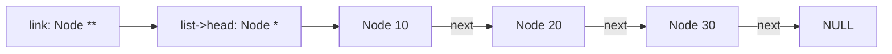
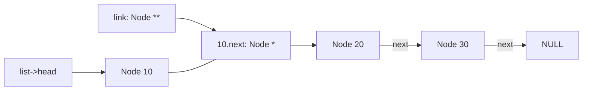

# Week 5 Lecture Notes — Linked Lists and Pointer-to-Pointer Techniques

> October 6, 2026 · Source lineage: previous linked-list notes and the 2025
> Week 1–3 notebooks; examples were consolidated around explicit ownership

> Python bridge: [Python Contrast Companion for Week 5](week05_python_companion.md)

---

## Student route

- **Core:** draw node ownership, use a `Node**` link-location cursor for head and
  interior changes, reverse links without losing nodes, and destroy the list.
- **Practice:** complete the [Week 5 exercise](lecture_exercises/week05_ex.md),
  which deliberately uses a bare owning head pointer; compare it afterward with
  [the complete example](examples.c).
- **Supporting ideas:** the `struct List` representation adds a cached size;
  circular lists and Josephus are comparative applications after the linear-list
  invariant is secure.
- **Python bridge:** use the companion to compare references and mutation, while
  keeping C allocation and ownership explicit.

---

## Learning objectives

By the end of this lecture, you should be able to:

1. Represent a singly linked list with dynamically allocated nodes.
2. Implement insertion, removal, traversal, and destruction.
3. Use a pointer-to-pointer to update a link uniformly.
4. State list invariants and ownership rules.
5. Compare linked-list and array operation costs.
6. Specify and test indexed insertion, removal, filtering, and subrange reversal
   without losing nodes or dereferencing freed storage.

---

## Three-hour plan

| Hour | Main question | In-class production |
|------|---------------|---------------------|
| 1 | How is a linked structure represented and owned? | Build, print, and validate a list by hand |
| 2 | How can one algorithm update the head or an interior link? | Implement insertion, removal, and reversal with pointer-to-pointer reasoning |
| 3 | When is a circular linked representation justified? | Solve and compare Josephus implementations, then run memory tests |

Each hour alternates explanation, pointer diagrams, live coding, and short
practice. Exercises labelled **Core live** belong to the planned classroom
route. Exercises labelled **Extension** may move to the lab or independent
study when the class needs more time for link tracing.

### Inline practice routine

For each **Try it now** activity:

1. draw every node and the link that owns it;
2. predict the changed links, return value, output, or diagnostic;
3. make the smallest requested edit or trace;
4. compile valid code with `-std=c17 -Wall -Wextra -Wpedantic`; and
5. explain why every node remains reachable exactly once or is released.

Only the question is visible initially. Expand **Reveal solution** after making
and checking an attempt. A solution provides expected output, a completed link
trace, or an explanation that the example itself has no run-time output.

- **Core live:** part of the planned in-class route.
- **Extension:** additional practice for the lab, a break, or later study.

The core-live activities total about 21 minutes in Hour 1, 24 minutes in Hour 2,
and 20 minutes in Hour 3. The remaining time is for explanation, live coding,
questions, transitions, and a short break.

---

## Hour 1 — Representation, construction, and ownership

> **Hour 1 route:** [Why link nodes?](#1-why-link-nodes)
> → [Representation and invariants](#2-representation-and-invariants)
> → [Two interfaces used this week](#two-interfaces-used-this-week)
> → [Allocate one node safely](#3-allocate-one-node-safely)
> → [Separate payload from structure](#separate-payload-from-structure)
> → [Insert at the front](#4-insert-at-the-front)
> → [Validate the invariant during development](#validate-the-invariant-during-development)
> → [construction trace](#hour-1-construction-trace)

### 1. Why link nodes?

An array stores elements contiguously. A linked list stores each element in a
node that points to the next node.

```text
head
  |
  v
+-------+------+    +-------+------+    +-------+------+
|  10   |   o--+--->|  20   |   o--+--->|  30   | NULL |
+-------+------+    +-------+------+    +-------+------+
```

This permits insertion without shifting later elements, but costs one pointer
per node, non-contiguous memory access, and linear-time indexing.

#### Try it now [Core live] — compare one insertion (3 minutes)

Draw an array containing `10, 20, 30` and the list above. Insert `15` before
`20` in each representation. Which existing values or links must change?

<details>
<summary>Reveal solution</summary>

The array must move `20` and `30` one position to the right before storing
`15`. In the list, after a new node has been allocated and initialized, only
two links change:

```text
before: 10.next -> 20
new:    15.next -> 20
after:  10.next -> 15
```

The logical sequence becomes `10, 15, 20, 30` in both representations. This is
a link and cost trace, not a complete program, so it has no run-time output.

</details>

---

### 2. Representation and invariants

```c
#include <stddef.h>

struct Node {
  int value;
  struct Node* next;
};

struct List {
  struct Node* head;
  size_t size;
};
```

Our representation invariant is:

- `head == NULL` exactly when `size == 0`;
- following `next` reaches exactly `size` nodes and then `NULL`;
- every reachable node is owned by this list;
- no node is reachable twice (the list has no cycle).

#### Try it now [Core live] — test the representation invariant (3 minutes)

Classify these states as valid or invalid: `(head == NULL, size == 0)`, one
reachable node with `size == 0`, three reachable nodes with `size == 3`, and a
three-node chain whose last link points back to the first node.

<details>
<summary>Reveal solution</summary>

| State | Valid? | Reason |
|-------|--------|--------|
| `head == NULL`, `size == 0` | yes | the empty representation satisfies every clause |
| one reachable node, `size == 0` | no | emptiness and reachable-node count disagree |
| three-node chain ending in `NULL`, `size == 3` | yes | count, ownership, and termination agree |
| last node links back to first | no | traversal cycles and a node becomes reachable repeatedly |

These are representation states rather than executions, so there is no
standard output. The table is the expected invariant trace.

</details>

---

### Two interfaces used this week

The lecture uses `struct List` because a public container abstraction can cache
its size and protect a larger invariant. The exercise starter deliberately
removes that wrapper and passes `Node** head` so that the link-location technique
is visible with less surrounding code. Translate between them as follows:

| Lecture representation | Exercise representation |
|------------------------|-------------------------|
| owning link `list->head` | owning link `*head` |
| address of owning link `&list->head` | address already received as `head` |
| cached `list->size` | determine boundaries by walking nodes |

Do not mix the two function signatures in one implementation. The node and
ownership reasoning is identical; only the container wrapper differs. A later
refactor can place the exercise's head pointer in `struct List` and update the
cached size after every successful mutation.

#### Try it now [Extension] — translate one owning link (3 minutes)

For a function that may replace the head node, write the parameter type for the
bare-head exercise and identify the expression that gives the equivalent link
location in the lecture's `struct List` representation.

<details>
<summary>Reveal solution</summary>

The bare-head function receives `struct Node** head`. With a `struct List* list`,
the corresponding link location is `&list->head`, whose type is also
`struct Node**`. This type exercise has no run-time output.

</details>

Initialize every link before publishing the node into the list.

```c
void list_init(struct List* list) {
  list->head = NULL;
  list->size = 0;
}
```

#### Try it now [Core live] — establish the empty state (2 minutes)

After calling `list_init(&list)`, draw `list.head` and record `list.size`. Which
invariant clauses can already be checked without traversing a node?

<details>
<summary>Reveal solution</summary>

```text
list.head -> NULL
list.size = 0
```

The empty-state equivalence holds, traversal reaches zero nodes, and no node can
be repeated. `list_init` prints nothing; the two-line state trace is the
expected result.

</details>

---

### 3. Allocate one node safely

```c
#include <stdlib.h>

static struct Node* node_create(int value, struct Node* next) {
  struct Node* node = malloc(sizeof(*node));
  if (node == NULL) return NULL;
  node->value = value;
  node->next = next;
  return node;
}
```

The function returns ownership of a new node or reports failure with `NULL`.
Because it is `static`, it is a private implementation detail of `list.c`.

#### Try it now [Core live] — trace node construction (4 minutes)

Call `node_create(20, old_head)` conceptually. Trace both allocation success and
allocation failure. On which path may the caller publish the returned pointer?

<details>
<summary>Reveal solution</summary>

```text
success: node -> {value: 20, next: old_head}; caller receives new ownership
failure: return NULL; old_head and every existing node remain unchanged
```

Only the non-`NULL` result may be published as a list link. The function has no
standard output; its observable result is the returned pointer and initialized
node state.

</details>

---

### Separate payload from structure

The link fields describe the **shape** of the list; the other fields are its
**payload**, meaning the data the list stores. Keeping these two roles separate
makes it easier to reuse the same list ideas for integers, strings, tokens, or
game objects. A node can own a heap-allocated string, borrow a string, or store
the bytes inline; these choices change destruction and copy behavior.

```c
struct StringNode {
  char* owned_text;
  struct StringNode* next;
};
```

If `owned_text` is owned, node creation must duplicate the string and node
destruction must free it before freeing the node. If it is borrowed, the source
string must outlive the list. Never leave this decision implicit.

#### Try it now [Extension] — choose a string ownership contract (3 minutes)

For one version in which `owned_text` owns a copy and another in which the node
borrows text, state the creation and destruction responsibilities. Do not write
a copying function yet.

<details>
<summary>Reveal solution</summary>

| Design | Creation | Destruction | Lifetime requirement |
|--------|----------|-------------|----------------------|
| owned copy | allocate and copy text before publishing the node | free text, then free node | independent of caller's original string |
| borrowed text | store the supplied pointer | free only the node | source string must outlive every borrowing node |

This is an API-contract exercise and produces no run-time output.

</details>

---

### 4. Insert at the front

```c
int list_push_front(struct List* list, int value) {
  struct Node* node = node_create(value, list->head);
  if (node == NULL) return 0;
  list->head = node;
  ++list->size;
  return 1;
}
```

Order matters: allocate first, connect the new node to the old head, and only
then replace `head`. If allocation fails, the original list is unchanged.

#### Try it now [Core live] — publish a new head safely (4 minutes)

Starting from `10 -> 20 -> NULL` with `size == 2`, trace
`list_push_front(&list, 5)`. Give the final sequence and size. Then trace the
allocation-failure path.

<details>
<summary>Reveal solution</summary>

```text
success:
  allocate node {5, old head}
  list.head -> 5 -> 10 -> 20 -> NULL
  list.size = 3
  return 1

failure:
  list.head -> 10 -> 20 -> NULL
  list.size = 2
  return 0
```

`list_push_front` itself prints nothing. With `list_print` from Hour 3, the
successful state would print `5 -> 10 -> 20` followed by a newline.

</details>

---

### Validate the invariant during development

```c
int list_is_valid(const struct List* list) {
  size_t observed = 0;
  const struct Node* node = list->head;
  while (node != NULL) {
    ++observed;
    if (observed > list->size) return 0; /* cycle or wrong size */
    node = node->next;
  }
  return observed == list->size;
}
```

This finite check detects many, but not every, malformed representation. Call it
with `assert(list_is_valid(list))` at public-operation boundaries while
developing. The `assert` macro from `<assert.h>` stops a debugging run when its
condition is false; it is for programmer invariants, not recoverable input or
allocation failures, and a build may disable it with `NDEBUG`. Later compare
this check with Floyd's tortoise-and-hare cycle detector, which does not rely on
`size`.

#### Try it now [Extension] — trace the validation loop (4 minutes)

For `10 -> 20 -> 30 -> NULL`, trace `observed` when `size` is `3` and when it
is incorrectly `2`. What prevents an accidental cycle from making this
particular check loop forever?

<details>
<summary>Reveal solution</summary>

```text
size 3: observed becomes 1, 2, 3; traversal reaches NULL; return 1
size 2: observed becomes 1, 2, 3; 3 > 2; return 0 immediately
```

For a cycle, `observed` eventually becomes greater than the cached `size`, so
the function returns `0`. It prints nothing. It still depends on `size` being a
reasonable finite bound; Floyd's algorithm detects a cycle without that cached
field.

</details>

---

### Hour 1 construction trace

#### Try it now [Core live] — build without losing the old head (5 minutes)

Starting from an empty list, push `30`, `20`, then `10`. Draw every allocation
before and after the head update. Repeat with a forced allocation failure on the
third push and prove that the original two-node list remains valid and owned.

<details>
<summary>Reveal solution</summary>

```text
initial:        head -> NULL, size 0
push 30:        head -> 30 -> NULL, size 1
push 20:        head -> 20 -> 30 -> NULL, size 2
push 10:        head -> 10 -> 20 -> 30 -> NULL, size 3

forced failure on push 10:
                head -> 20 -> 30 -> NULL, size 2
```

Each successful node owns the previous head through its initialized `next`
field before `list->head` changes. On failure no new node exists and the old
head is never overwritten. The functions produce no standard output unless a
driver calls `list_print`.

</details>

---

## Hour 2 — Link-location algorithms

> **Hour 2 route:** [A link is a modifiable location](#5-a-link-is-a-modifiable-location)
> → [Insert in sorted order](#6-insert-in-sorted-order)
> → [Reverse in place](#reverse-in-place)
> → [Remove all matching nodes](#remove-all-matching-nodes)
> → [Optional supplementary practice](#optional-supplementary-practice)
> → [Sequence-editor case study: specify before rewiring](#sequence-editor-case-study-specify-before-rewiring)
> → [Design invariants for the four operations](#design-invariants-for-the-four-operations)
> → [Edge-case matrix](#edge-case-matrix)
> → [Sequence-editor checkpoint](#sequence-editor-checkpoint)

### 5. A link is a modifiable location

Removing a node usually requires either changing `list->head` or changing a
previous node's `next`. A pointer-to-pointer lets one loop treat both as “the
link that points to the current node.”

The important idea is that `link` points to a **box that contains a node
pointer**, not directly to the node:



After one loop step, `link = &(*link)->next` makes the same variable point to
the `next` box inside the first node:



Writing `*link = ...` therefore changes whichever incoming link currently owns
the node: either `list->head` or one node's `next` field.

Linus Torvalds used this linked-list deletion contrast in his TED2016 interview
as an example of programming “taste.” A conventional traversal remembers the
previous node and then needs a special branch for the head:

```c
struct Node* previous = NULL;
struct Node* current = list->head;
while (current != NULL && current->value != target) {
  previous = current;
  current = current->next;
}
if (current != NULL) {
  if (previous == NULL) {
    list->head = current->next;
  } else {
    previous->next = current->next;
  }
  free(current);
  --list->size;
}
```

The issue is not that this version cannot work. Its state describes nodes, while
the actual mutation target is a **link**. Representing that link directly removes
the artificial head/interior distinction:

```c
int list_remove_first(struct List* list, int target) {
  struct Node** link = &list->head;

  while (*link != NULL && (*link)->value != target) {
    link = &(*link)->next;
  }

  if (*link == NULL) return 0;

  struct Node* removed = *link;
  *link = removed->next;
  free(removed);
  --list->size;
  return 1;
}
```

There is no special head-removal branch because `link` initially points to the
head field itself. “Good taste” here means choosing a representation that makes
the invariant and exceptional cases disappear; it is not a rule that additional
indirection is always preferable.

#### Try it now [Core live] — follow the owning link (6 minutes)

Starting from `10 -> 20 -> 30 -> NULL`, trace `link`, `*link`, the changed
incoming link, the return value, and final size when the target is `10`, `20`,
and `99`. Treat each call independently.

<details>
<summary>Reveal solution</summary>

| Target | Final `link` location | Changed link | Result |
|--------|-----------------------|--------------|--------|
| `10` | `&list->head` | `list->head = removed->next` | `20 -> 30`, size 2, return 1 |
| `20` | `&node10->next` | `node10->next = removed->next` | `10 -> 30`, size 2, return 1 |
| `99` | address of `node30->next` | none | list unchanged, size 3, return 0 |

In the successful cases the bypass link is written before `removed` is freed;
no later expression reads the freed node. The function prints nothing. With
`list_print`, the two successful final states would print `20 -> 30` and
`10 -> 30`, respectively.

</details>

---

### 6. Insert in sorted order

```c
int list_insert_sorted(struct List* list, int value) {
  struct Node** link = &list->head;
  while (*link != NULL && (*link)->value < value) {
    link = &(*link)->next;
  }

  struct Node* node = node_create(value, *link);
  if (node == NULL) return 0;
  *link = node;
  ++list->size;
  return 1;
}
```

The loop invariant is: every node before `*link` has value less than `value`,
and `link` is the exact location that must be updated for insertion.

#### Try it now [Core live] — insert at the owning location (4 minutes)

Starting from `10 -> 30 -> 50`, trace insertion of `30` and then insertion of
`60` in separate runs. Where does `link` stop, and where do equal values go?

<details>
<summary>Reveal solution</summary>

```text
insert 30:
  link stops at the link owning the existing 30
  result: 10 -> 30(new) -> 30(old) -> 50
  size increases by one; return 1

insert 60:
  link stops at the final NULL link
  result: 10 -> 30 -> 50 -> 60
  size increases by one; return 1
```

The strict `< value` condition places a new equal value before existing equal
values. Allocation failure leaves the original list unchanged. The function
itself produces no standard output.

</details>

---

### Reverse in place

```c
void list_reverse(struct List* list) {
  struct Node* reversed = NULL;
  struct Node* remaining = list->head;

  while (remaining != NULL) {
    struct Node* next = remaining->next;
    remaining->next = reversed;
    reversed = remaining;
    remaining = next;
  }
  list->head = reversed;
}
```

Loop invariant: `reversed` owns the already processed prefix in reverse order;
`remaining` owns the untouched suffix; together they contain exactly the
original nodes, with no node reachable from both.

#### Try it now [Core live] — reverse without losing the suffix (5 minutes)

Trace `reversed`, `remaining`, and the saved `next` pointer for
`10 -> 20 -> 30 -> NULL`. Why must `next` be saved before assigning
`remaining->next = reversed`?

<details>
<summary>Reveal solution</summary>

```text
start:  reversed = NULL          remaining = 10 -> 20 -> 30
step 1: reversed = 10 -> NULL    remaining = 20 -> 30
step 2: reversed = 20 -> 10      remaining = 30
step 3: reversed = 30 -> 20 -> 10, remaining = NULL
finish: list.head = reversed
```

Saving `next` preserves the only pointer to the untouched suffix before the
current link is reversed. The function prints nothing; `list_print` afterward
would produce:

```text
30 -> 20 -> 10
```

</details>

---

### Remove all matching nodes

Extend the pointer-to-pointer pattern:

```c
size_t list_remove_all(struct List* list, int target) {
  size_t removed_count = 0;
  struct Node** link = &list->head;
  while (*link != NULL) {
    if ((*link)->value == target) {
      struct Node* removed = *link;
      *link = removed->next;
      free(removed);
      --list->size;
      ++removed_count;
    } else {
      link = &(*link)->next;
    }
  }
  return removed_count;
}
```

After removal, do not advance `link`: it already designates the next link to
inspect. This is the key case when adjacent nodes match.

#### Try it now [Core live] — remove adjacent matches (4 minutes)

Trace removal of `2` from `1 -> 2 -> 2 -> 3 -> 2`. Record the link location
after every removal, the returned count, and the final size.

<details>
<summary>Reveal solution</summary>

```text
skip 1:       link designates 1.next
remove 2:     1.next now owns the next 2; do not advance link
remove 2:     1.next now owns 3; do not advance link
skip 3:       link designates 3.next
remove 2:     3.next becomes NULL
final list:   1 -> 3 -> NULL
removed:      3
```

If the original size is five, the final size is two. The function returns `3`
and prints nothing. A subsequent `list_print` would print `1 -> 3`.

</details>

---

### Optional supplementary practice

#### Try it now [Extension] — design four related interfaces (6 minutes)

Sketch contracts and tests for:

1. `list_find` returning a borrowed node pointer;
2. `list_insert_after` taking a borrowed position;
3. `list_clone` returning a deep copy with the same order;
4. `list_equal` without exposing nodes to the caller.

Define behavior when the position does not belong to the list. Decide whether
the API can detect that efficiently or must state it as a precondition.

<details>
<summary>Reveal solution</summary>

One consistent design is:

| Operation | Ownership result | Essential tests |
|-----------|------------------|-----------------|
| `list_find` | return a borrower or `NULL` | empty, first, last, absent |
| `list_insert_after` | list retains ownership of every node | valid position, allocation failure, foreign position according to contract |
| `list_clone` | return a distinct owner or report failure | empty, several nodes, partial-allocation cleanup, source independence |
| `list_equal` | borrow both lists | both empty, unequal size, first mismatch, equal payloads |

Membership of an arbitrary position requires a traversal unless the API states
that the caller must supply a node borrowed from this list. This panel specifies
contracts and tests without providing complete implementations; it has no
run-time output.

</details>

---

### Sequence-editor case study: specify before rewiring

Consider a playlist represented by a singly linked list of integer track IDs.
The requested operations are deliberately stated with half-open, zero-based
positions:

- insert a track **before** position `position`, permitting `position == size`;
- remove the track at `position`, reporting failure when it does not exist;
- remove every track satisfying a supplied predicate;
- reverse the node range `[first, last)`, leaving all other nodes in place.

A **predicate** is a function that classifies an element with a true/false
result. The operation removes a node exactly when the supplied predicate
accepts that node's payload.

Do not begin with pointer assignments. First decide whether the representation
uses a real head pointer or a dummy/sentinel node. A sentinel is never playlist
data; it can simplify front mutations, but size, traversal, and destruction
must consistently exclude it. Mixing the two representations is a common cause
of null dereferences and accidental sentinel deletion.

---

### Design invariants for the four operations

For an index walk, record the meaning of the cursor after `k` links rather than
relying on comments such as “near the destination.” For a link-location design,
the useful invariant is:

```text
link designates the pointer field that owns the node at the current position
```

For remove-all, adjacent matches must not be skipped: after unlinking and
freeing a node, the same incoming link now designates the next candidate. For a
subrange reversal, maintain three disjoint regions throughout the operation:

```text
unchanged prefix | range being rearranged | unchanged suffix
```

Every original node must remain reachable from exactly one region until the
regions are reconnected. Save any needed successor before changing or freeing
the current node.

---

### Edge-case matrix

Before writing pseudocode, predict behavior for:

| Operation | Cases that define the contract |
|-----------|--------------------------------|
| Insert | empty list, front, middle, end, position beyond end |
| Remove at | empty list, front, last, position equal to size |
| Remove if | no match, head match, adjacent matches, every node matches |
| Reverse range | empty range, one node, starts at zero, ends at size, invalid order |

Draw the links before and after each accepted case. For rejected cases, require
that the list is unchanged. Then write function contracts or pseudocode—but not
a complete implementation—and use the drawings as an oracle for later tests.

---

### Sequence-editor checkpoint

#### Try it now [Core live] — trace indexed edits before coding (5 minutes)

Starting independently from `11 → 22 → 33 → 44 → 55`, draw these
operations: insert `99` before position 2; remove position 3; remove every value
less than 30; reverse `[1, 4)`; and reverse `[0, size)`. For each, state the
resulting size and the first incoming link that changes.

<details>
<summary>Reveal solution</summary>

| Operation | Result | Size | First changed incoming link |
|-----------|--------|------|-----------------------------|
| insert `99` before 2 | `11 → 22 → 99 → 33 → 44 → 55` | 6 | `22.next` |
| remove position 3 | `11 → 22 → 33 → 55` | 4 | `33.next` |
| remove values `< 30` | `33 → 44 → 55` | 3 | `head`, then the same head link again |
| reverse `[1, 4)` | `11 → 44 → 33 → 22 → 55` | 5 | `11.next` |
| reverse `[0, 5)` | `55 → 44 → 33 → 22 → 11` | 5 | `head` |

Each accepted edit preserves ownership of every retained node exactly once.
Removed nodes must be released; reversal changes links but neither allocates nor
frees nodes. These are expected state traces, not complete implementation code.

</details>

---

## Hour 3 — Traversal variants, circular lists, and Josephus

> **Hour 3 route:** [Traversal and read-only borrowing](#7-traversal-and-read-only-borrowing)
> → [Destroy the entire list](#8-destroy-the-entire-list)
> → [Complexity and representation choice](#9-complexity-and-representation-choice)
> → [Circular lists and Josephus](#10-circular-lists-and-josephus)
> → [The Josephus problem, stated precisely](#the-josephus-problem-stated-precisely)
> → [Circular-list representation](#circular-list-representation)
> → [Josephus comparison](#josephus-comparison)
> → [verification](#hour-3-verification)

### 7. Traversal and read-only borrowing

`FILE*` is the standard I/O library's stream handle. A caller can pass `stdout`
to print to the terminal or another writable stream to select a different
destination without changing the traversal algorithm.

```c
#include <stdio.h>

void list_print(const struct List* list, FILE* stream) {
  for (const struct Node* node = list->head; node != NULL; node = node->next) {
    fprintf(stream, "%d%s", node->value, node->next == NULL ? "\n" : " -> ");
  }
}
```

The function borrows the list and does not mutate it. The local traversal
pointer is non-owning; it must never be passed to `free`.

#### Try it now [Core live] — predict traversal output (3 minutes)

Call `list_print` on an empty list and on `10 -> 20 -> 30 -> NULL`. What is
written to the stream, and which objects may the function modify?

<details>
<summary>Reveal solution</summary>

The empty list executes zero loop iterations and writes nothing. The nonempty
list writes:

```text
10 -> 20 -> 30
```

The final node contributes the newline. The `const struct List*` and
`const struct Node*` access paths permit reading but not modifying the list or
its nodes; only the external stream changes.

</details>

---

### 8. Destroy the entire list

```c
void list_clear(struct List* list) {
  struct Node* node = list->head;
  while (node != NULL) {
    struct Node* next = node->next;
    free(node);
    node = next;
  }
  list->head = NULL;
  list->size = 0;
}
```

Save `next` **before** freeing the node. Reading `node->next` after `free(node)`
would be a use-after-free.

#### Try it now [Core live] — end every node lifetime once (4 minutes)

Trace `list_clear` on `10 -> 20 -> 30 -> NULL`. After each iteration, identify
the saved successor, the node whose lifetime ends, and the remaining owner.

<details>
<summary>Reveal solution</summary>

```text
iteration 1: save 20; free 10; local node now advances to 20
iteration 2: save 30; free 20; local node now advances to 30
iteration 3: save NULL; free 30; local node becomes NULL
finish:      list.head = NULL; list.size = 0
```

During the loop, the local `node` pointer temporarily keeps the remaining chain
reachable after the old head node is released. The function prints nothing.
Calling `list_print` after clearing writes nothing because the list is empty.

</details>

---

### 9. Complexity and representation choice

| Operation | Dynamic array | Singly linked list |
|-----------|---------------|--------------------|
| Index `i` | O(1) | O(i) |
| Push front | O(n) | O(1) |
| Insert after known position | O(n) shifts | O(1) |
| Find a value | O(n) | O(n) |
| Cache locality | Good | Usually poor |
| Per-element overhead | None | One link and allocator metadata |

Big-O does not say the list is automatically faster. For many workloads,
contiguous arrays win because allocation and memory locality matter.

#### Try it now [Extension] — choose from access patterns (3 minutes)

Choose an array or singly linked list for (a) frequent random indexing and
(b) repeated insertion after a position that is already known. State one cost
that Big-O notation omits.

<details>
<summary>Reveal solution</summary>

- Random indexing favors an array because element `i` is reached in O(1).
- Insertion after a known node can favor a linked list because rewiring is O(1);
  finding that node would still be O(n) if it were not already known.
- Cache locality, allocation overhead, per-node memory, and constant factors are
  examples of costs hidden by Big-O notation.

This is a design comparison and has no run-time output.

</details>

---

### 10. Circular lists and Josephus

> **Algorithm application:** the required list foundation is a correct owned
> linear list. Circular links and Josephus compare representations after those
> invariants are secure.

In a circular list, the last node points back to the first instead of `NULL`.
This can model repeated elimination in the Josephus problem. It also changes
the invariant and termination condition: traversal must remember the starting
node or a count, and destruction must deliberately break or walk the cycle.

Use a circular list because the problem is circular, not merely because it is an
interesting structure. The Josephus problem also has array and mathematical
solutions with different tradeoffs.

---

### The Josephus problem, stated precisely

Arrange `n` participants in a circle and number them `1` through `n`. Begin at
participant `1`. Count only participants who remain in the circle; remove every
`k`-th participant, then resume counting at the next remaining participant.
Continue until one participant remains. The usual task asks for the survivor;
some versions also ask for the complete removal order.

For `n = 7` and `k = 3`, count `1, 2, 3`, remove `3`, and resume at `4`:

| Round | Circle before counting | Removed | Next start |
|-------|------------------------|---------|------------|
| 1 | `1 2 3 4 5 6 7` | `3` | `4` |
| 2 | `4 5 6 7 1 2` | `6` | `7` |
| 3 | `7 1 2 4 5` | `2` | `4` |
| 4 | `4 5 7 1` | `7` | `1` |
| 5 | `1 4 5` | `5` | `1` |
| 6 | `1 4` | `1` | `4` |

The removal order is `3, 6, 2, 7, 5, 1`; participant `4` survives. This hand
trace fixes three common ambiguities: whether counting includes the current
participant, where counting resumes, and whether labels change after removal.

#### Try it now [Core live] — apply the counting convention (4 minutes)

Using exactly the convention above, trace `n = 5` and `k = 2`. Give the complete
removal order and survivor before expanding the solution.

<details>
<summary>Reveal solution</summary>

| Round | Circle before counting | Removed | Next start |
|-------|------------------------|---------|------------|
| 1 | `1 2 3 4 5` | `2` | `3` |
| 2 | `3 4 5 1` | `4` | `5` |
| 3 | `5 1 3` | `1` | `3` |
| 4 | `3 5` | `5` | `3` |

The removal order is `2, 4, 1, 5`, and participant `3` survives. This expected
trace is also an oracle for a small array or circular-list implementation.

</details>

---

### Circular-list representation

A useful representation stores a `tail` whose `next` is the head:

```c
struct CircularList {
  struct Node* tail;
  size_t size;
};

/* empty: tail == NULL
   nonempty: tail->next is head, and size links return to head */
```

Insertion after the tail is O(1), as is access to the head. Destruction must use
the stored size or first break the cycle; a `while (node != NULL)` loop never
terminates.

#### Try it now [Extension] — draw the circular invariant (3 minutes)

Draw empty, singleton, and three-node circular lists using the `tail`
representation. For each nonempty state, identify `tail->next` and the number
of links required to return to the head.

<details>
<summary>Reveal solution</summary>

```text
empty:     tail = NULL, size 0
singleton: tail -> 1, 1.next -> 1, size 1
three:     tail -> 3, 3.next -> 1 -> 2 -> 3, size 3
```

For every nonempty state, `tail->next` is the head, and following exactly
`size` links from the head returns to the head. These declarations and drawings
produce no run-time output.

</details>

---

### Josephus comparison

For `n` participants and step `k`, compare three approaches:

| Approach | Main state | Typical cost | What it naturally produces |
|----------|------------|--------------|----------------------------|
| Array, erase removed entry | remaining labels plus current index | O(n²) because later entries shift | full removal order |
| Circular linked list | predecessor/current node and remaining count | O(nk) link steps; removal itself is O(1) | full removal order |
| Recurrence `J(1,k)=0`, `J(n,k)=(J(n-1,k)+k) mod n` | survivor index for the smaller circle | O(n) time, O(1) space iteratively | survivor only |

The recurrence uses zero-based positions. Add one to report a participant label
from `1` through `n`. It works by imagining that after the first removal, the
smaller circle is renumbered from its new starting point; adding `k` maps that
answer back to the original numbering.

The recursive and iterative versions express the same recurrence. The iterative
form below makes the changing subproblem size visible and avoids using one
call-stack frame per participant:

```c
#include <assert.h>

static int josephus_survivor(int count, int step) {
  assert(count > 0);
  assert(step > 0);

  int survivor = 0; /* J(1, step), in zero-based numbering */
  for (int circle_size = 2; circle_size <= count; ++circle_size) {
    survivor = (int)(((long long)survivor + step) % circle_size);
  }
  return survivor + 1; /* convert to the labels 1 through count */
}
```

For `count = 7` and `step = 3`, the successive zero-based survivor positions
for circle sizes `1` through `7` are `0, 1, 1, 0, 3, 0, 3`; the final `+1`
therefore reports participant `4`. This algorithm cannot produce the removal
order because that information is not part of its state.

The structure-simulation version is still valuable when the complete
elimination order is required. Algorithm selection follows the requested output.

#### Try it now [Core live] — connect the recurrence to the hand trace (5 minutes)

Trace `josephus_survivor(5, 2)` by recording `survivor` for circle sizes 1
through 5. Compare the returned label with the earlier elimination trace. What
information can this function not print without a different algorithm?

<details>
<summary>Reveal solution</summary>

```text
circle size: 1  2  3  4  5
J(size, 2):  0  0  2  0  2
returned label: 2 + 1 = 3
```

A driver containing `printf("%d\n", josephus_survivor(5, 2));` prints:

```text
3
```

That agrees with the hand trace. The recurrence retains only the survivor
position, so it cannot reconstruct or print the removal order `2, 4, 1, 5`.

</details>

---

### Hour 3 verification

#### Try it now [Core live] — turn traces into tests (4 minutes)

Run empty, singleton, adjacent-removal, head/tail, and full-destruction cases
under AddressSanitizer. For the circular version, additionally test `k = 1`,
`k > n`, and repeated wraparound. Compare the elimination order with a simple
array reference implementation on small `n`.

<details>
<summary>Reveal solution</summary>

A satisfactory verification record contains:

| Category | Expected evidence |
|----------|-------------------|
| empty/singleton | no invalid dereference; size and head/tail invariants hold |
| adjacent removal | every matching node is removed without skipping |
| head/tail mutation | the owning boundary link changes to the expected node |
| destruction | owner becomes `NULL`; sanitizer reports no invalid access |
| Josephus `k = 1` | participants leave in label order until the final survivor |
| wraparound and `k > n` | array and circular simulations produce the same order |

Exact sanitizer text is platform-dependent. A valid run should emit no
sanitizer diagnostic; functional output must match the hand-built oracle. The
repository's [complete example](examples.c) builds `10, 20, 30`, reverses it,
removes its middle node, and prints:

```text
30 10
```

</details>

---

## Midterm project connection — Tokens are a representation boundary

The project uses a linked representation while recognizing tokens and may
convert it into a form convenient for indexed parsing. Trace the incoming link,
current token, and list owner for empty input, one token, several tokens, and an
invalid character. The conversion must preserve token order and define who
releases both representations.

Use AI to generate adversarial input categories, then reduce each suggestion to
a precise expected token sequence or expected rejection. Do not ask it to fill
the graded parser TODOs. Thursday's evidence is a hand trace and test table that
will be reused in Week 7.

### Try it now [Extension] — audit one token conversion (5 minutes)

Choose a three-token input. Draw the linked representation, the indexed result,
and the owner of each allocation immediately before and after conversion. Then
add one failure during partial conversion and identify every required cleanup.

<details>
<summary>Reveal solution</summary>

A correct trace must show the same token order in both representations, name
whether conversion copies or transfers payload ownership, and leave exactly one
owner for every live allocation. On partial failure, all newly created indexed
storage must be released while the input list remains valid unless the published
contract explicitly consumes it. Exact token values depend on the chosen input,
so the deliverable is an ownership table and expected sequence rather than
project implementation code or one fixed output.

</details>

---

## Check yourself

1. Draw `link`, `*link`, and `**link` during removal of the second node.
2. Why is a traversal pointer not an owner?
3. Add `list_pop_front` and state its failure behavior.
4. Why must the list representation explicitly distinguish a sentinel from a
   data node?
5. Which handles must be saved before removing a node or rewiring a range?
6. Which invariant detects an accidental cycle?
7. Run insertion and removal tests under AddressSanitizer.

---

## Summary

- A linked list is a chain of separately allocated nodes.
- The list owns every reachable node and must release each exactly once.
- A pointer-to-pointer uniformly represents the link being inspected or changed.
- Indexed edits require an explicit position convention and unchanged-on-failure
  contract.
- Mutation should preserve invariants even when allocation fails.
- Choose a representation using access patterns and real costs, not Big-O alone.

---

## Optional enrichment — Doubly linked lists

A doubly linked node adds `previous`. Every mutation must update two directions;
the invariant requires `node->next->previous == node` and
`node->previous->next == node` where neighbors exist. It enables O(1) removal
from a known node without searching for its predecessor but adds memory and more
ways to corrupt links.

---

## References and source materials

- [Linus Torvalds, *The mind behind Linux* (TED2016)](https://www.ted.com/talks/linus_torvalds_the_mind_behind_linux)
- [Linked lists](<https://github.com/htchen/i2p-nthu/blob/master/程式設計二/mid1/2-linked_list.md>)
- [Linked-list supplementary notes](<https://github.com/htchen/i2p-nthu/blob/master/程式設計二/mid1/2-linked_list_sup.md>)
- [Josephus problem](<https://github.com/htchen/i2p-nthu/blob/master/程式設計二/mid1/3-josephus_problem.md>)
- [Instructor slides: *Josephus Problem*](../../assets/references/josephus_lee.pptx)
- [2025 Week 1 notebook (Colab)](https://colab.research.google.com/drive/1Asu-XpzM8EfrB8ANf4ze4ejDUdgIFGq0)
- [2025 Week 2 notebook (Colab)](https://colab.research.google.com/drive/1U1VXgyhO50YCJUTD7BPrA-zvr6GTMHIr)
