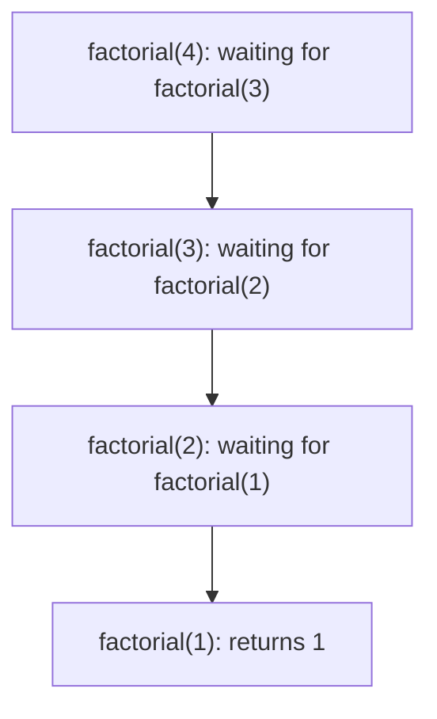
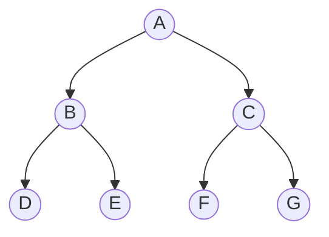

# Week 6 Lecture Notes — Recursion and Binary Trees

> October 13, 2026 · Source lineage: previous recursion and binary-tree notes,
> the 2025 Week 3–4 notebooks, and the instructor-provided *From C to Assembly*
> handout

> Python bridge: [Python Contrast Companion for Week 6](week06_python_companion.md)

## Learning objectives

By the end of this lecture, you should be able to:

1. Write a recursive function from a decreasing problem measure.
2. Trace recursive calls and stack frames.
3. Represent and traverse a binary tree.
4. Build and destroy an owning tree safely.
5. Relate tree shape to time and stack-space complexity.
6. Explain when traversal pairs determine a unique tree and when multiple
   interpretations must be validated or counted.
7. Structure a small exhaustive search as choose, recurse, validate, and undo.

## Three-hour plan

| Hour | Main question | In-class production |
|------|---------------|---------------------|
| 1 | How do recursive contracts guarantee progress? | Trace recursion and a choose/recurse/undo search |
| 2 | How does tree shape determine traversal order? | Draw trees and derive traversal/query functions |
| 3 | What can traversal sequences prove about a tree? | Reconstruct, validate, and compare possible interpretations |

## Hour 1 — Recursive reasoning and the call stack

### 1. A recursive proof becomes a recursive program

A correct recursive design needs:

1. a **contract** for what the function returns;
2. one or more **base cases** solved directly;
3. a recursive case using smaller instances;
4. a **decreasing measure** that guarantees reaching a base case.

```c
unsigned long long factorial(unsigned int n) {
  if (n <= 1) return 1;
  return n * factorial(n - 1);
}
```

The measure `n` decreases. This function is structurally correct but its result
still overflows quickly; recursion does not remove numeric limits.

### 2. Stack frames

Each active call has its own parameters, local variables, and return location.
Tracing `factorial(4)`:

```text
factorial(4)
  4 * factorial(3)
        3 * factorial(2)
              2 * factorial(1)
                    1
```

After the base case, calls finish in reverse order. Recursion depth consumes
stack space. A missing base case, a non-decreasing argument, or a valid but very
deep input can exhaust the process stack. In an online judge this normally
appears as **Runtime Error** (often a segmentation fault), not as Python's
`RecursionError`. C does not provide a portable recursion-depth exception that
you can catch.



Each unfinished box is one active call. The boxes disappear in the reverse
order as return values move upward.

<details>
<summary>Optional machine-code lens: calls, frames, and the ABI</summary>

At the machine level, a call must preserve enough information to resume the
caller. A platform's application binary interface (ABI) specifies where
arguments and return values go, which registers a function must preserve, stack
alignment, and related conventions. A traditional 32-bit x86 trace may show:

- a `call` that records a return address and transfers control;
- a prologue that saves a frame pointer and reserves local storage;
- parameters and locals addressed relative to that frame pointer;
- a return value placed in a designated register; and
- an epilogue followed by `ret` to resume the caller.

None of those exact instruction sequences is required by C. Modern ABIs often
pass initial arguments in registers; a compiler can omit the frame pointer,
inline a function, reuse storage, or eliminate a call. Stack growth toward lower
addresses is common on x86 but is also an implementation detail.

Recursion creates one distinct source-level function activation per unfinished
call. It commonly creates repeated machine stack frames, which explains how
parameters and locals from different calls remain distinct and why excessive
depth can overflow finite stack space. Tail-call elimination can sometimes
reuse a frame, but C does not guarantee it.

Compile a small recursive sum with `-O0 -S` and `-O2 -S`. Week 4 explains that
`-S` produces assembly, while `-O0` disables optimization; `-O2` enables a
substantial set of optimizations. At each level, mark the base-case branch,
recursive call or replacement loop, returned value, and evidence that the
argument progresses. Do not make correctness depend on optimized recursion
being replaced with iteration.

</details>

<details>
<summary>Optional contrast examples: Euclid's algorithm and fast exponentiation</summary>

### Euclid's algorithm

```c
int gcd(int a, int b) {
  if (b == 0) return a < 0 ? -a : a;
  return gcd(b, a % b);
}
```

Contract: for supported inputs, return the nonnegative greatest common divisor.
The absolute value of the second argument decreases after reduction. Discuss
the `INT_MIN` limitation and decide whether the production interface should use
a wider type or reject that case.

### Fast exponentiation

Fast exponentiation reduces the exponent by half instead of by one:

```c
long long power(long long base, unsigned int exponent) {
  if (exponent == 0) return 1;
  long long half = power(base, exponent / 2);
  if (exponent % 2 == 0) return half * half;
  return half * half * base;
}
```

The decreasing measure is `exponent`; depth is O(log exponent). Arithmetic may
still overflow. Trace `power(3, 5)` and draw when multiplication happens on the
unwinding path.

</details>

### Recursion versus iteration

Use recursion when it exposes the structure of the proof or data. Use iteration
when the state transition is simpler and deep recursion risks the stack. Tail
calls are not guaranteed to be optimized by C, so rewriting a linear recursive
loop may be necessary for unbounded input.

### Quick comparison

For Fibonacci, binary search, and linked-list length, identify the problem
measure, number of recursive calls, maximum depth, and overlapping subproblems.
Explain why naive Fibonacci is exponential while the other two need not be.

### Classic divide-and-recombine example: Towers of Hanoi

To move `n` disks from peg `A` to peg `C` using peg `B`:

1. move the top `n - 1` disks from `A` to `B`;
2. move the largest disk from `A` to `C`;
3. move the `n - 1` disks from `B` to `C`.

```c
#include <stdio.h>

void hanoi(unsigned int n, char from, char temporary, char to) {
  if (n == 0) return;
  hanoi(n - 1, from, to, temporary);
  printf("move disk %u: %c -> %c\n", n, from, to);
  hanoi(n - 1, temporary, from, to);
}
```

The measure `n` decreases, but each non-base call creates two recursive calls.
The number of moves satisfies `T(n) = 2T(n - 1) + 1 = 2^n - 1`. Trace `n = 3`
before running it and check that no larger disk is ever placed on a smaller one.

### Backtracking: choose, recurse, undo

Some small search spaces are naturally described by a sequence of decisions.
A backtracking function maintains a partial answer, chooses one permitted next
step, recurses, and then **undoes** that step before trying another choice. The
undo step restores the caller's invariant; omitting it silently removes valid
branches.

### Classic backtracking example: N queens

Place one queen in each row of an `n × n` chessboard so that no two queens share
a column or diagonal. A recursive call represents “rows `0` through `row - 1`
are already valid.” For every column in the current row:

1. reject it immediately if the column or either diagonal is occupied;
2. mark the three occupied lines;
3. recurse on `row + 1`;
4. unmark the three lines before trying the next column.

```text
choose a safe column
    -> mark column and diagonals
        -> solve the next row
    -> undo all three marks
```

The base case `row == n` means one complete placement was found. This is more
efficient than generating all `n!` row-to-column permutations and validating
only at the end because unsafe partial boards are pruned immediately. For the
four-queen problem, draw the search branches for the first queen in columns `0`
and `1`, and identify the first point at which each impossible branch stops.

Complete search is appropriate only when the published bound is small. Estimate
the largest search tree before coding, and look for safe early rejection rules.

Keep the search state and validation rules explicit. Pass the current queen
positions, occupied-line sets, and result accumulator as parameters or group
them in a context structure. Hidden mutable `static` work buffers make repeated
calls and tests harder to reason about.

### Hour 1 checkpoint

For factorial, Towers of Hanoi, and N queens, state the contract, base case,
decreasing measure, maximum depth, and number of recursive calls per non-base
case. Then explain which one uses “undo” and why the other two do not.

## Hour 2 — Recursive data and traversal design

### 3. Recursion follows recursive data

```c
struct TreeNode {
  int value;
  struct TreeNode* left;
  struct TreeNode* right;
};
```

A tree is either empty (`NULL`) or a node with two smaller trees. The data
definition suggests the program structure.

### Traversal orders

Use this tree for the first trace:



```c
#include <stddef.h>
#include <stdio.h>

void preorder(const struct TreeNode* node) {
  if (node == NULL) return;
  printf("%d ", node->value);
  preorder(node->left);
  preorder(node->right);
}

void inorder(const struct TreeNode* node) {
  if (node == NULL) return;
  inorder(node->left);
  printf("%d ", node->value);
  inorder(node->right);
}

void postorder(const struct TreeNode* node) {
  if (node == NULL) return;
  postorder(node->left);
  postorder(node->right);
  printf("%d ", node->value);
}
```

- Preorder handles the root before its children.
- Inorder handles the root between left and right.
- Postorder handles children before the root.

The appropriate order follows the task, not a memorized ranking.

For the pictured tree:

| Order | Visit sequence | How to read it |
|-------|----------------|----------------|
| Preorder | `A B D E C F G` | root, then left subtree, then right subtree |
| Inorder | `D B E A F C G` | left subtree, root, right subtree |
| Postorder | `D E B F G C A` | left subtree, right subtree, root |

Point to the line containing `printf` in each function: its position relative
to the two recursive calls exactly matches the order's definition.

### 4. Aggregate queries

```c
#include <stddef.h>

size_t tree_size(const struct TreeNode* node) {
  if (node == NULL) return 0;
  return 1 + tree_size(node->left) + tree_size(node->right);
}

int tree_height(const struct TreeNode* node) {
  if (node == NULL) return -1; /* height measured in edges */
  int left = tree_height(node->left);
  int right = tree_height(node->right);
  return 1 + (left > right ? left : right);
}
```

Define conventions explicitly. Some books call an empty tree height `0` and a
leaf height `1`; this note measures edges, so they are `-1` and `0`.

### Derive, do not memorize, traversal order

Choose the moment to process the root:

- print an outline before children → preorder;
- print BST values in order → inorder;
- compute a directory's size after child sizes → postorder;
- release a resource after owned children → postorder;

Week 7 applies the same idea to expression trees. Moving evaluation there lets
us first establish traversal on ordinary binary trees, then add operator-node
invariants when the compiler pipeline is introduced.

### Hour 2 board exercise

For a seven-node tree, derive preorder, inorder, and postorder sequences. Then
work backward: given preorder and inorder with unique labels, circle the root,
partition both sequences, and repeat on each subtree. Include an empty subtree
and a one-child node rather than using only a perfect tree.

## Hour 3 — BST construction, reconstruction, and ownership

### 5. Build a binary search tree

For a binary search tree (BST), all values in the left subtree are smaller and
all values in the right subtree are larger under our no-duplicates policy.

```c
#include <stdlib.h>

int bst_insert(struct TreeNode** link, int value) {
  while (*link != NULL) {
    if (value < (*link)->value) {
      link = &(*link)->left;
    } else if (value > (*link)->value) {
      link = &(*link)->right;
    } else {
      return 1; /* already present */
    }
  }

  struct TreeNode* node = malloc(sizeof(*node));
  if (node == NULL) return 0;
  node->value = value;
  node->left = NULL;
  node->right = NULL;
  *link = node;
  return 1;
}
```

This iterative version reuses the pointer-to-pointer technique from linked
lists. A recursive insertion is also natural; both must preserve the BST
invariant and handle allocation failure.

### 6. Destruction is postorder

```c
void tree_destroy(struct TreeNode* node) {
  if (node == NULL) return;
  tree_destroy(node->left);
  tree_destroy(node->right);
  free(node);
}
```

Free the children before the parent because their addresses are stored in the
parent. This is postorder traversal applied to resource ownership.

At the owning call site:

```c
tree_destroy(root);
root = NULL;
```

### 7. Reconstructing from traversals

For distinct values, preorder gives the root first and inorder tells which
values belong to the left and right subtrees.

```text
preorder: A B D E C F
inorder:  D B E A C F

root = A
left inorder  = D B E   -> left preorder  = B D E
right inorder = C F     -> right preorder = C F
```

The same argument recursively reconstructs both subtrees. A simple linear
search for each root gives O(n²) worst-case time; an index map can reduce it to
O(n), provided values are unique.

### Which traversal pairs are sufficient?

With distinct labels:

- preorder plus inorder determines one ordered binary tree;
- inorder plus postorder determines one ordered binary tree;
- preorder plus postorder does **not** generally determine one tree.

The ambiguity appears as soon as a node has one child. Both of these trees have
preorder `A B` and postorder `B A`:

```text
    A          A
   /            \
  B              B
```

Their inorder sequences differ (`B A` versus `A B`), so the missing inorder
information is exactly what distinguishes the two orientations. If the domain
guarantees a full binary tree—every internal node has two children—distinct
preorder and postorder labels are sufficient; without that structural promise,
ambiguity is part of the problem rather than an input error.

### Validate before reconstructing or counting

For any traversal-consistency task, check the contract before exploring tree
shapes:

1. sequence lengths agree;
2. all sequences contain the same label set or multiset;
3. the stated distinctness/duplicate policy holds;
4. the first preorder label agrees with the last postorder label;
5. each recursive subtree occupies a contiguous segment of every traversal;
6. every indexed search checks the bound before reading the candidate element.

The final item matters in C: write the bounds test on the left side of `&&` so
short-circuit evaluation proves the array access is valid.

### 8. Shape determines cost

Every full traversal visits `n` nodes: O(n) time. Its additional stack use is
O(h), where `h` is tree height.

- Balanced tree: `h = O(log n)`.
- Completely skewed tree: `h = O(n)`.

BST search and insertion are O(h), not automatically O(log n). A plain BST can
degrade into a linked list when values arrive in sorted order.

### Search and extrema

```c
const struct TreeNode* bst_find(const struct TreeNode* node, int target) {
  while (node != NULL) {
    if (target < node->value)
      node = node->left;
    else if (target > node->value)
      node = node->right;
    else
      return node;
  }
  return NULL;
}

const struct TreeNode* bst_minimum(const struct TreeNode* node) {
  if (node == NULL) return NULL;
  while (node->left != NULL) node = node->left;
  return node;
}
```

Both return borrowed pointers. They do not transfer ownership, and a later tree
mutation or destruction may invalidate them.

### Reconstruction implementation plan

Use half-open ranges in the traversal arrays. A helper receives preorder range,
inorder range, and an output tree link. Allocate the root only after validating
that it appears in the inorder range. If either subtree fails, destroy any
partial children and the root before returning failure.

### Hour 3 integration test

Insert a sequence, verify inorder ordering and recorded size, search present and
absent values, reconstruct one tree from two traversals, and destroy both trees.
Run the insertion sequence for balanced and sorted orders; compare observed
height and maximum recursion depth.

### 9. Tree testing strategy

Include at least:

- empty tree;
- one node;
- only-left and only-right chains;
- balanced shape;
- duplicate insertion under the chosen policy;
- allocation failure if the design permits injection;
- traversal sequences and size/height agreement;
- destruction under AddressSanitizer.

Useful properties include “inorder output of a BST is strictly increasing” and
“size after inserting a new distinct value increases by exactly one.”

## Midterm project connection — AST checkpoint

An abstract syntax tree uses the same recursive ownership model as the trees in
this lecture, but its node kind determines which children and payload are
valid. In Thursday's lab, construct a small tree for a supplied expression,
traverse it in evaluation order, and destroy it in postorder. Include one
deliberately failed child allocation and show how the partial tree is released.

This is a non-graded miniature rather than a solution to the project parser.
The full lab supplies tree-ownership practice before Week 7 parsing. Week 6
material is included in the Midterm 1 scope; Week 7 material is
excluded because it is first presented two days before the exam.

## Check yourself

1. Identify the base case and decreasing measure in `tree_size`.
2. Why is preorder unsuitable for `tree_destroy`?
3. Draw the BST produced by `4, 2, 6, 1, 3, 5, 7`.
4. How does inserting sorted input affect recursion depth?
5. Reconstruct a tree from `preorder: 2 1 3` and `inorder: 1 2 3`.
6. Give two different trees with preorder `A B` and postorder `B A`.
7. What must a choose/recurse/undo generator restore before trying the next
   candidate?
8. (Optional) List the checks required before counting traversal interpretations.

## Summary

- Recursive code should follow a contract, base case, and decreasing measure.
- Tree structure naturally produces recursive algorithms.
- Traversal order describes when the root is processed relative to children.
- Preorder/postorder ambiguity comes from missing child-orientation information;
  stated structural constraints determine whether reconstruction is unique.
- Backtracking is practical only when its state, restoration invariant, and
  factorial search bound are explicit.
- Ownership determines destruction order.
- Complexity depends on tree height as well as node count.

## Optional enrichment

These extensions preserve the original problem-solving ideas but are outside
the three-hour core. They are suitable for a lab, homework preparation, or a
later review session.

### Counting traversal interpretations

For a small label bound, one general strategy is to generate candidate inorder
arrangements and pass each complete candidate to an independent traversal
validator. A second strategy reasons directly about legal recursive subtree
partitions. The first is easier to specify but grows factorially; the second can
avoid unrelated candidates but requires a careful recurrence and duplicate
policy.

Complete this design sheet before implementing either strategy:

| Question | Required decision |
|----------|-------------------|
| Counted object | tree shapes, ordered trees, or distinct inorder sequences? |
| Labels | distinct, repeated, or invalid when repeated? |
| Empty input | zero interpretations or one empty tree? |
| Candidate state | what does one recursive call represent? |
| Base case | what exactly is validated or counted? |
| Pruning | which partial contradictions are safe to reject? |
| Complexity | what input bound makes the method feasible? |

For distinct labels, preorder plus a candidate inorder determines at most one
tree. For preorder `A B C` and postorder `C B A`, identify all consistent inorder
sequences by hand and compare examined arrangements with valid interpretations.

### BST deletion cases

BST removal separates three cases:

1. leaf: replace its incoming link with `NULL`;
2. one child: replace its incoming link with that child;
3. two children: copy the inorder successor/predecessor value, then remove that
   replacement node from its original one-child position.

Implement deletion with a pointer-to-pointer to the root link. Draw ownership
before coding and test leaf, one-child, and two-child roots under a sanitizer.

## References and source materials

- [Instructor handout: *From C to Assembly*](../../assets/references/from_c_to_assembly.pdf)
- [Recursion](<https://github.com/htchen/i2p-nthu/blob/master/程式設計一/Recursive/README.md>)
- [Binary trees](<https://github.com/htchen/i2p-nthu/blob/master/程式設計二/mid1/4-binary_tree.md>)
- [2025 Week 3 notebook (Colab)](https://colab.research.google.com/drive/1QnjMWtqSx2WqZ2AUDUln_Na3LxJ4YX2m)
- [2025 Week 4, part 1 notebook (Colab)](https://colab.research.google.com/drive/1FfWMQCxEjI-K9m7qJJw1OTiiDMhLFf2c)
