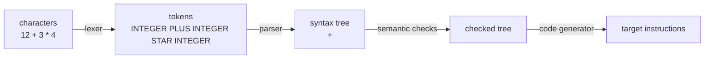
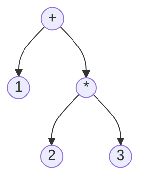

# Week 7 Lecture Notes — Expression Parsing and Syntax Trees

> October 20, 2026 · Source lineage: previous syntax-tree, computer, and
> assembly notes, the 2025 Week 4–5 compiler notebooks, and the
> instructor-provided *From C to Assembly* handout

> Python bridge: [Python Contrast Companion for Week 7](week07_python_companion.md)

## Learning objectives

By the end of this lecture, you should be able to:

1. Separate lexical analysis, parsing, semantic analysis, and code generation.
2. Write an unambiguous expression grammar with precedence and associativity.
3. Implement a recursive-descent parser that produces an AST.
4. Evaluate and release an AST safely.
5. Connect AST structure to stack-machine code generation.

## Three-hour plan

| Hour | Main question | In-class production |
|------|---------------|---------------------|
| 1 | How do characters become a trustworthy token stream? | Complete and test a position-aware lexer |
| 2 | How does grammar become an owning syntax tree? | Trace recursive descent and implement one precedence level |
| 3 | How does tree meaning become checked instructions? | Add semantic checks, generate code, and test end to end |

## Hour 1 — Compiler stages and lexical analysis

### 1. A small compiler is a pipeline



Each stage gives a simpler contract to the next:

- **Lexer:** groups characters into tokens such as integers and operators.
- **Parser:** checks grammatical structure and builds an abstract syntax tree.
- **Semantic analysis:** checks rules not captured conveniently by the grammar.
- **Code generation:** emits instructions that implement the tree's meaning.

Do not make every function inspect raw input. Good intermediate representations
localize errors and make stages testable independently.

### 2. Tokens

```c
enum TokenKind {
  TOKEN_INTEGER,
  TOKEN_PLUS,
  TOKEN_MINUS,
  TOKEN_STAR,
  TOKEN_SLASH,
  TOKEN_LEFT_PAREN,
  TOKEN_RIGHT_PAREN,
  TOKEN_END,
  TOKEN_INVALID
};

struct Token {
  enum TokenKind kind;
  long value;
  size_t position;
};
```

The lexer should always make progress: consume a valid token, skip permitted
whitespace, or consume/report an invalid character. Recording the source
position makes later diagnostics precise.

The complete teaching example intentionally parses numeric expressions only.
The project adds identifiers and more operators using the same pipeline. Keeping
the teaching language small lets us see every ownership and error path.

### A lexer skeleton

```c
struct Lexer {
  const char* input;
  size_t position;
};

static char peek(const struct Lexer* lexer) {
  return lexer->input[lexer->position];
}

static char take(struct Lexer* lexer) {
  char current = peek(lexer);
  if (current != '\0') ++lexer->position;
  return current;
}
```

A token carries the starting position, kind, and parsed value. Integer scanning
must detect overflow while accumulating rather than after overflow has occurred:

```c
#include <limits.h>

long value = 0;
while (isdigit((unsigned char)peek(lexer))) {
  int digit = take(lexer) - '0';
  if (value > (LONG_MAX - digit) / 10) {
    return token_invalid(start);
  }
  value = value * 10 + digit;
}
```

Cast to `unsigned char` before calling `<ctype.h>` classification functions;
passing a negative plain `char` other than `EOF` is undefined behavior.

The declarations above and all helper definitions appear together in the
[complete Week 7 example](examples.c). The
[starter file](lecture_exercises/week07_starter.c) uses the same `TokenKind`,
`Token`, `Lexer`, `AstKind`, `Ast`, and `Parser` types. Lecture fragments below
focus on one idea at a time; use the complete example when you need a compilable
program rather than guessing an omitted helper.

### Hour 1 lexer lab

For input `" 12 + 3*x"`, write every token with `[start,end)`, kind, and
value/lexeme. Then test empty input, every operator, `INT_MAX`, one overflowing
integer, an invalid byte between valid tokens, and repeated calls after end.
The parser should never need to inspect raw characters or repeat overflow logic.

## Hour 2 — Precedence grammar, recursive descent, and AST ownership

### 3. Grammar encodes precedence

This grammar makes multiplication bind tighter than addition and makes binary
operators left-associative:

```text
expression  -> term (('+' | '-') term)*
term        -> unary (('*' | '/') unary)*
unary       -> ('+' | '-') unary | primary
primary     -> INTEGER | IDENTIFIER | '(' expression ')'
```

For `1 + 2 * 3`, `expression` contains one `term` for `1` and another whose
tree is `2 * 3`. For `8 - 3 - 2`, the repetition builds `(8 - 3) - 2`.

Grammar is executable design: one parser function corresponds to each
nonterminal.

### 4. AST representation

```c
enum AstKind {
  AST_INTEGER,
  AST_ADD,
  AST_SUBTRACT,
  AST_MULTIPLY,
  AST_DIVIDE,
  AST_NEGATE
};

struct Ast {
  enum AstKind kind;
  long value;
  struct Ast* left;
  struct Ast* right;
};
```

Representation rules:

- `AST_INTEGER` stores its number in `value` and has no children.
- `AST_NEGATE` uses `left` as its operand and has no right child.
- Binary nodes own both child trees.

An AST omits punctuation that was required only to parse. Parentheses affect
shape but do not need their own nodes.

### 5. Parser state and errors

```c
struct Parser {
  struct Lexer lexer;
  struct Token current;
  const char* error;
};

static void parser_advance(struct Parser* parser) {
  parser->current = lexer_next(&parser->lexer);
}
```

Every parser function follows a useful contract:

- on success, return an owned AST and leave `current` at the first unused token;
- on failure, return `NULL`, record one diagnostic, and release partial trees.

The top-level parse succeeds only if an expression is followed by `TOKEN_END`.
Accepting a valid prefix while ignoring trailing garbage is a parser bug.

### 6. Recursive descent

Simplified additive parsing:

```c
static struct Ast* parse_expression(struct Parser* parser) {
  struct Ast* left = parse_term(parser);
  if (left == NULL) return NULL;

  while (parser->current.kind == TOKEN_PLUS ||
         parser->current.kind == TOKEN_MINUS) {
    enum TokenKind operation = parser->current.kind;
    parser_advance(parser);

    struct Ast* right = parse_term(parser);
    if (right == NULL) {
      ast_destroy(left);
      return NULL;
    }

    enum AstKind kind = operation == TOKEN_PLUS ? AST_ADD : AST_SUBTRACT;
    struct Ast* combined = ast_create(kind, 0, left, right);
    if (combined == NULL) {
      ast_destroy(left);
      ast_destroy(right);
      return NULL;
    }
    left = combined;
  }
  return left;
}
```

Updating `left` after each operator creates left association. Notice the
failure paths: every successfully constructed subtree has exactly one owner.

### Precedence trace

Trace `-2 * (3 + 4) - 5` as a table:

| Function | Token on entry | Result on return | First unused token |
|----------|----------------|------------------|--------------------|
| `parse_primary` | `2` | integer 2 | `*` |
| `parse_unary` | `-` | negate(2) | `*` |
| `parse_term` | `-` | multiply(negate(2), add(3,4)) | `-` |
| `parse_expression` | `-` | subtract(previous,5) | end |

Students should fill the omitted intermediate calls and draw the owned tree.
This makes it visible that unary minus is syntax, not part of the integer token.

### AST constructors centralize invariants

```c
static struct Ast* ast_create(enum AstKind kind, long value, struct Ast* left,
                              struct Ast* right) {
  int is_number = kind == AST_INTEGER && left == NULL && right == NULL;
  int is_unary = kind == AST_NEGATE && left != NULL && right == NULL;
  int is_binary = kind != AST_INTEGER && kind != AST_NEGATE && left != NULL &&
                  right != NULL;
  if (!is_number && !is_unary && !is_binary) return NULL;

  struct Ast* node = malloc(sizeof(*node));
  if (node == NULL) return NULL;
  node->kind = kind;
  node->value = value;
  node->left = left;
  node->right = right;
  return node;
}
```

Define whether ownership transfers only on success or whenever nonnull children
are passed. `ast_create` transfers ownership only when it succeeds; on failure,
the parser destroys both children itself. A mismatched convention causes leaks
or double free.

`parse_primary` handles integers and parenthesized expressions:

```c
static struct Ast* parse_primary(struct Parser* parser) {
  if (parser->current.kind == TOKEN_INTEGER) {
    long value = parser->current.value;
    parser_advance(parser);
    return ast_create(AST_INTEGER, value, NULL, NULL);
  }

  if (parser->current.kind == TOKEN_LEFT_PAREN) {
    parser_advance(parser);
    struct Ast* inside = parse_expression(parser);
    if (inside == NULL) return NULL;
    if (parser->current.kind != TOKEN_RIGHT_PAREN) {
      parser->error = "expected ')'";
      ast_destroy(inside);
      return NULL;
    }
    parser_advance(parser);
    return inside;
  }

  parser->error = "expected an integer or '('";
  return NULL;
}
```

### Hour 2 guided implementation

Implement `parse_unary` and `parse_term`. Use malformed cases to inspect cleanup
paths: `1 +`, `2 * )`, `(3 + 4`, `--`, and a forced allocation failure after the
left subtree exists. Require the first error position and verify that no AST
allocation leaks.

## Hour 3 — Semantics, evaluation, and code generation

### 7. Evaluation is postorder

Week 6 introduced postorder on ordinary binary trees. An expression tree adds
one invariant: number nodes have no children, a negation node owns one child,
and a binary operator owns two children. For `1 + 2 * 3`, precedence produces:



Postorder visits `1, 2, 3, *, +`. Each operator runs only after the values of
its children are available.

```c
int ast_evaluate(const struct Ast* node, long* result) {
  if (node->kind == AST_INTEGER) {
    *result = node->value;
    return 1;
  }

  long left;
  long right;
  if (!ast_evaluate(node->left, &left)) return 0;
  if (node->kind == AST_NEGATE) {
    *result = -left;
    return 1;
  }
  if (!ast_evaluate(node->right, &right)) return 0;

  switch (node->kind) {
    case AST_ADD:
      *result = left + right;
      return 1;
    case AST_SUBTRACT:
      *result = left - right;
      return 1;
    case AST_MULTIPLY:
      *result = left * right;
      return 1;
    case AST_DIVIDE:
      if (right == 0) return 0;
      *result = left / right;
      return 1;
    default:
      return 0;
  }
}
```

Production code must also define and check overflow behavior. The complete
example rejects arithmetic overflow; the shorter fragment keeps the traversal
visible. Semantic analysis can reject invalid constructs before code generation.
This evaluator fragment covers the lecture's numeric trees. When the project
adds identifier nodes, evaluation requires an environment that maps each
identifier to its current value.

### Semantic checks are not parsing

The grammar can accept forms whose meaning is invalid. In the project compiler,
increment/decrement or assignment-like operations require a modifiable variable
rather than an arbitrary expression. Keep this rule in a separate semantic
function such as `is_modifiable`. After the project adds identifier nodes, that
function returns true exactly for the node kinds the specification defines as
modifiable. It must reject a number, a binary result, and any other temporary
expression.

An AST retains enough structure to report “left operand is not modifiable” at
the operator position. Do not twist the grammar until it rejects every
context-sensitive rule.

### 8. From tree to instructions

#### Real assembly and the teaching target

A native compiler and this course's mini compiler solve the same broad lowering
problem but target different contracts. Native assembly commonly includes
register-to-register or register-to-memory transfers, arithmetic instructions,
labels and conditional jumps, and an ABI for calls and returns. Structured C
such as `if (value > 3)` may become a comparison followed by a jump that skips
the body when the condition is false; the compiler need not preserve the
source's positive wording.

The project target is a deliberately smaller simulated instruction set. Its
specification, register count, memory model, side-effect order, and cycle rules
are authoritative. Do not emit an x86 instruction just because it appeared in
the native assembly for similar C, and do not infer that the simulator follows
the host machine's calling convention.

Use native C-to-assembly output as a comparison exercise: identify loads,
stores, arithmetic, comparisons, branches, labels, calls, and returns. Then map
the same source behavior to the project target one semantic step at a time.
This separates the portable behavior being compiled from one machine's encoding.

For a simple stack machine, generate the left subtree, then the right subtree,
then the operation:

```text
AST:       (+)
          /   \
         1    (*)
             /   \
            2     3

PUSH 1
PUSH 2
PUSH 3
MUL
ADD
```

This is postorder traversal. A register machine adds a resource-allocation
problem: which temporary register holds each intermediate result? The midterm
project's hidden tests check language behavior, but the demo checks whether you
can connect emitted instructions back to AST structure.

### Register pressure and evaluation order

For a target with a small fixed register set, annotate every subtree with the
number of registers required without spilling. A useful heuristic evaluates the
more demanding subtree first. If both results cannot remain in registers, emit
a store to temporary memory and reload it later.

For each instruction, maintain an invariant describing where the subexpression
value resides. Optimization must preserve that invariant and observable side
effects; fewer cycles are irrelevant if evaluation order becomes incorrect.

### Differential testing and demo rehearsal

Execute each AST in two ways: direct evaluation and generated code in the ASMC
simulator. Generate many small valid expressions and compare results, then keep
separate expected-failure tests for syntax, semantics, division by zero, and
resource exhaustion.

For rehearsal, a student should tokenize one expression, draw its AST, identify
owned allocations, explain semantic acceptance, predict instructions, make one
small live change, and add a test that fails without the change.

### 9. Test stages independently

- Lexer: whitespace, multi-digit integers, each operator, invalid characters.
- Parser: precedence, associativity, parentheses, unary chains, missing tokens.
- Semantics: division by zero or invalid update targets, as specified.
- Generator: smallest tree for every node kind and nested combinations.
- End to end: compare interpreter and generated-code results.

Property idea: pretty-print an AST with sufficient parentheses, parse it again,
and compare evaluation results.

## Midterm project handoff — Integrate against the real contracts

The lecture's small grammar and stack-machine example teach the pipeline, but
the project specification is authoritative. Before implementation, write its
exact precedence levels, associativity, prefix/postfix behavior, lvalue rules,
variable-memory mapping, and target-instruction constraints. Do not silently
substitute the lecture grammar or instruction model.

Verification should proceed stage by stage:

1. compare token sequences with the source text;
2. print or hand-trace AST shapes for precedence and associativity cases;
3. test valid and invalid increment/decrement operands;
4. trace side effects and evaluation order before emitting instructions;
5. run generated instructions with ASMC and compare final values with an
   independent oracle where the language subset permits it;
6. run valid and rejected inputs under sanitizers;
7. optimize instruction cycles only after all correctness evidence passes.

Use AI for counterexamples, trace review, and diagnosis. If it proposes code,
require it to name the grammar production and ownership contract being
implemented, then verify those claims manually. The demo may ask for an
AI-free explanation or a small modification in any of these stages.

Because Thursday is Midterm 1, the asynchronous checkpoint covers a bounded
stage-gate plan and representative traces rather than a scheduled integration
lab. Week 7 material is excluded from the exam. Complete the remaining parser,
semantic, code-generation, and verification gates incrementally before the
Week 10 demo.

## Check yourself

1. Draw the AST for `-1 + 2 * (3 - 4)`.
2. Why does the grammar use a loop for left-associative binary operators?
3. Where must a partial tree be freed when the right operand fails to parse?
4. Why must the top-level parser require `TOKEN_END`?
5. Emit stack-machine instructions for `(8 - 3) / 5`.

## Summary

- A compiler pipeline replaces one complicated task with testable stages.
- Grammar structure expresses precedence and associativity.
- Recursive-descent functions mirror grammar nonterminals.
- AST edges express ownership as well as syntax.
- Evaluation, destruction, and simple code generation are tree traversals.

## References and source materials

- [Instructor handout: *From C to Assembly*](../../assets/references/from_c_to_assembly.pdf)
- [Instructor slides: *Assembly*](../../assets/references/lee_assembly.pptx)
- [Syntax trees](<https://github.com/htchen/i2p-nthu/blob/master/程式設計二/mid1/5-syntax_tree.md>)
- [A simple computer model](<https://github.com/htchen/i2p-nthu/blob/master/程式設計二/mid1/6-Computer.md>)
- [Assembly language](<https://github.com/htchen/i2p-nthu/blob/master/程式設計二/mid1/7-Assembly.md>)
- [2025 Week 4, part 2 notebook (Colab)](https://colab.research.google.com/drive/1ELmeNLoaZT6f7DGXwAXbk72O83E2Hbn7)
- [2025 Week 5 notebook (Colab)](https://colab.research.google.com/drive/1cqxmTwoWv7E8g3sxzyEPYNL9a0K1fnfb)
