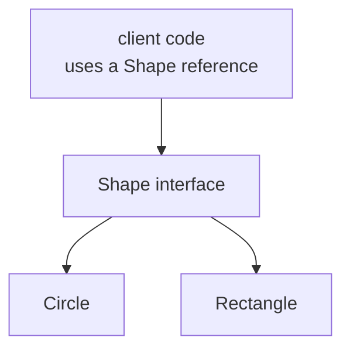

# Week 13 Lecture Notes — Inheritance and Runtime Polymorphism

> December 1, 2026 · Source lineage: previous Classes III material and the
> class-hierarchy/variant sections of the 2025 Week 7 and Week 14 notebooks

> Python bridge: [Python Contrast Companion for Week 13](week13_python_companion.md)

## Student route

- **Core:** call an override through a base reference, preserve safe destruction
  through a virtual destructor, own heterogeneous objects with `unique_ptr`, and
  build a composite through the same interface.
- **Practice:** complete the [Week 13 exercise](lecture_exercises/week13_ex.md),
  which transfers the same design from shapes to numeric functions. Compare
  afterward with [the complete example](examples.cpp).
- **Optional:** `std::variant`, downcasting, and multiple-interface designs are
  alternatives or extensions; they are not required by the core exercise.
- **Python bridge:** use the companion to compare dynamic dispatch while keeping
  C++ ownership and destruction explicit.

## Learning objectives

By the end of this lecture, you should be able to:

1. Define an abstract interface with virtual functions.
2. Override behavior safely through references and pointers.
3. Explain why a polymorphic base needs a virtual destructor.
4. Avoid object slicing and preserve explicit polymorphic ownership.
5. Decide between inheritance and composition from the required substitution
   and variation.
6. Design a recursive polymorphic Composite with explicit construction,
   evaluation, transformation, and ownership contracts.

## Three-hour plan

| Hour | Main question | In-class production |
|------|---------------|---------------------|
| 1 | What contract makes derived objects genuinely substitutable? | Implement and test a Shape hierarchy |
| 2 | How do dispatch, destruction, and ownership interact? | Trace polymorphic calls and study one recursive Composite in depth |
| 3 | When should a design use inheritance or composition? | Compare alternatives and refactor one final-project hierarchy |

## Hour 1 — Abstract interfaces and substitutable overrides

### 1. Why introduce an abstraction?

Suppose a drawing program stores circles and rectangles separately. Every new
operation repeats the type decision:

```cpp
if (kind == CircleKind) {
  DrawCircle(circle);
} else if (kind == RectangleKind) {
  DrawRectangle(rectangle);
}
```

The same branch appears again for `area`, `Translate`, and later for every new
shape. An **abstraction** gives client code one small promise—“this object can
report its center, move, and report its area”—without requiring the client to
know the concrete shape.



The client depends on the stable interface. Each concrete type supplies its own
implementation. This is useful only when the common promise is genuine; an
interface created merely to avoid a few repeated lines can make a design harder
to understand.

### 2. Public inheritance means “can be used as”

Use public inheritance when every derived object can be used wherever the base
interface is expected without violating its contract. This property is called
**substitutability**: code written for `Shape&` must work correctly when the
actual object is a `Circle` or `Rectangle`.

```cpp
struct Point {
  double x;
  double y;
};

class Shape {
 public:
  virtual Point center() const = 0;
  virtual void Translate(Point offset) = 0;
  virtual double area() const = 0;
  virtual ~Shape() = default;
};
```

A pure virtual function (`= 0`) makes `Shape` abstract. It describes an
interface; `Shape shape;` is ill-formed because no complete base behavior exists.

### 3. Override the contract

```cpp
#include <cmath>
#include <stdexcept>

class Circle final : public Shape {
 public:
  Circle(Point center, double radius) : center_{center}, radius_{radius} {
    if (!std::isfinite(radius) || radius < 0.0) {
      throw std::invalid_argument{"radius must be finite and nonnegative"};
    }
  }

  Point center() const override {
    return center_;
  }

  void Translate(Point offset) override {
    center_.x += offset.x;
    center_.y += offset.y;
  }

  double area() const override {
    constexpr double pi = 3.141592653589793;
    return pi * radius_ * radius_;
  }

 private:
  Point center_;
  double radius_;
};

class Rectangle final : public Shape {
 public:
  Rectangle(Point corner, double width, double height)
      : corner_{corner}, width_{width}, height_{height} {
    if (!std::isfinite(width) || !std::isfinite(height) || width < 0.0 ||
        height < 0.0) {
      throw std::invalid_argument{
          "rectangle dimensions must be finite and nonnegative"};
    }
  }

  Point center() const override {
    return {corner_.x + width_ / 2.0, corner_.y + height_ / 2.0};
  }

  void Translate(Point offset) override {
    corner_.x += offset.x;
    corner_.y += offset.y;
  }

  double area() const override {
    return width_ * height_;
  }

 private:
  Point corner_;
  double width_;
  double height_;
};
```

`override` asks the compiler to verify that a base virtual function is actually
being overridden. It catches parameter, `const`, and spelling mismatches.
`final` prevents further derivation when the design intends a leaf class.

For example, this is probably a mistake:

```cpp
class Actor {
 public:
  virtual void Attack(int damage) = 0;
  virtual ~Actor() = default;
};

class Monster : public Actor {
 public:
  void Attack() {
  } /* a different overload; does not override Attack(int) */
};
```

Writing `void Attack() override` makes the compiler reject the mismatch at the
definition. Without `override`, the error may be discovered much later when the
class remains abstract or a call through the base interface cannot reach the
intended function. Treat `override` as a compile-time safety check, not only as
documentation.

### A derived class must keep the base promise

If `Shape::translate` accepts every finite offset, `Circle::translate` cannot
silently reject negative offsets. A derived operation may guarantee more in its
result but must not demand more from callers using the base contract.

Create contract tests that run against a `Shape&` and reuse them for every
derived type. This catches behavioral incompatibility that `override` syntax
alone cannot detect.

### Non-virtual interface pattern

```cpp
class GameObject {
 public:
  void Update(double seconds) {
    if (seconds < 0.0) throw std::invalid_argument{"negative time"};
    BeforeUpdate();
    DoUpdate(seconds);
    AfterUpdate();
  }
  virtual ~GameObject() = default;

 private:
  virtual void DoUpdate(double seconds) = 0;
  void BeforeUpdate() { /* common setup */
  }
  void AfterUpdate() { /* common cleanup */
  }
};
```

The public nonvirtual function enforces common checks and sequencing; derived
classes customize only the intended step. A derived class may override a
`private virtual` function even though it cannot call that function directly.
Keeping `DoUpdate` private prevents callers and derived classes from bypassing
the public `Update` sequence:

```text
Update(seconds)
    -> validate seconds
    -> BeforeUpdate()
    -> DoUpdate(seconds)   // the derived behavior
    -> AfterUpdate()
```

This pattern separates two questions: the base class controls **when** the
steps run, while the derived class supplies **what** happens in the designated
step.

### Hour 1 studio

Run the same center/translate/area contract tests against the supplied `Circle`
and `Rectangle` through `Shape&`. Then create a deliberately incorrect override
by omitting `const` or changing a parameter type, observe the compiler error, and
repair it. Do not add `CompositeShape` yet: Hour 2 introduces polymorphic
ownership before constructing a branch that owns child shapes.

## Hour 2 — Dynamic dispatch, ownership, and destruction

### 4. Dynamic dispatch requires indirection

```cpp
#include <iostream>

void PrintArea(const Shape& shape) {
  std::cout << shape.area() << '\n';
}

void DemonstrateDispatch() {
  Circle circle{{0.0, 0.0}, 2.0};
  PrintArea(circle); /* calls Circle::area */
}
```

The function accepts a base reference, but the virtual call selects behavior
using the object's dynamic type at run time.

Passing by value would slice:

```cpp
void Wrong(Shape value); /* abstract Shape makes this impossible here */
```

For a nonabstract base, copying a derived value into a base object discards the
derived part. Polymorphic APIs use references or pointers.

### 5. Polymorphic ownership

```cpp
#include <iostream>
#include <memory>
#include <vector>

void PrintExampleAreas() {
  std::vector<std::unique_ptr<Shape>> shapes;
  shapes.push_back(std::make_unique<Circle>(Point{0, 0}, 2.0));
  shapes.push_back(std::make_unique<Rectangle>(Point{1, 1}, 3.0, 4.0));

  for (const auto& shape : shapes) {
    std::cout << shape->area() << '\n';
  }
}
```

`unique_ptr<Shape>` owns one dynamically allocated object whose concrete type
may vary. Destroying through the base pointer calls the correct derived
destructor only because `Shape::~Shape` is virtual.

### What virtual dispatch stores conceptually

Typical implementations give a polymorphic object a hidden pointer to a table
of virtual functions. A call through `Shape&` uses that table to select the
derived override. The standard specifies behavior, not a particular table
layout; use this model for reasoning, not portable pointer arithmetic.

Virtual dispatch usually adds one indirection and may limit inlining. That cost
is often negligible next to game rendering or allocation, but measure when it
matters instead of eliminating abstraction speculatively.

### Destruction trace

Create a derived class with an owned vector/resource and instrument base and
derived destructors. Destroy through `unique_ptr<Shape>` and confirm derived
cleanup precedes base cleanup. Discuss what a nonvirtual base destructor would
fail to do without executing that undefined behavior.

Rule: if a class has any virtual function and objects may be deleted through a
base pointer, give it a public virtual destructor (or deliberately prevent such
deletion with a protected nonvirtual destructor in advanced designs).

### 6. Access control

- `public`: accessible through the interface.
- `protected`: accessible in the class and derived classes.
- `private`: accessible only to the class and its friends.

Prefer private data even in base classes. Protected data couples every derived
class to the representation. A protected helper function can expose a narrower
extension point.

Public inheritance normally preserves the public interface. Private inheritance
is closer to an implementation technique; composition is usually clearer.

### Recursive Composite case study

Composite is the hour's one detailed polymorphic design. `std::variant` is
retained later as a comparison, not developed as a second full implementation.

Some domains contain leaf and branch objects that clients should treat through
one interface. Consider a scoring expression with this conceptual hierarchy:

```text
Rule (abstract)
├── literal value
├── input lookup
├── unary rule  ── owns one child Rule
└── binary rule ── owns left and right Rule objects plus an operation tag
```

This is the **Composite** pattern: a branch contains objects satisfying the same
interface as the branch itself. A read-only operation such as
`evaluate(context)` recursively dispatches through the children. Its interface
should be `const` because evaluation observes the model rather than changing its
structure.

The abstract base needs a virtual destructor and a precise domain/error
contract. Every concrete override must handle its valid state or report failure
consistently; falling out of a non-void override or silently accepting an unknown
operation is not a valid default. Store operation choices with `enum class`
rather than loosely interpreted characters when the set is closed.

## Hour 3 — Composition and existing-project architecture

### 7. Composition before inheritance

“A game entity has a position” suggests composition:

```cpp
struct Transform {
  Point position{0.0, 0.0};
};

struct Sprite {
  int asset_id{0};
};

class Entity {
 private:
  Transform transform_;
  Sprite sprite_;
};
```

“A tower is a kind of game object that satisfies the game-object interface” may
justify inheritance. Ask:

1. Does the derived type preserve every base precondition and postcondition?
2. Will clients benefit from treating different derived types uniformly?
3. Is the hierarchy stable enough to become a public design commitment?
4. Would a member object or strategy object be simpler?

Inheritance solely to reuse a few lines often creates tighter coupling than a
composed helper.

### Strategy through composition

```cpp
#include <memory>
#include <stdexcept>
#include <utility>

class Movement {
 public:
  virtual Point Next(Point current, double seconds) = 0;
  virtual ~Movement() = default;
};

class MovingMonster {
 public:
  explicit MovingMonster(std::unique_ptr<Movement> movement)
      : movement_{std::move(movement)} {
    if (movement_ == nullptr) {
      throw std::invalid_argument{"movement is required"};
    }
  }

 private:
  std::unique_ptr<Movement> movement_;
};
```

Monster type and movement policy now vary independently. The monster uniquely
owns its strategy; a shared immutable strategy could instead be borrowed or
shared under an explicit lifetime design.

### 8. Final-project reading strategy

For an existing game hierarchy:

1. Find the abstract or common base.
2. List virtual functions and their contracts.
3. Find where objects are constructed and who owns them.
4. Trace one update and one draw call through dynamic dispatch.
5. Check whether destruction is virtual.
6. Identify where a composition or strategy would reduce subclass duplication.

### Hour 3 architecture review

Choose one repeated type-switch or `dynamic_cast` chain in the project template.
Propose two alternatives: add a virtual operation or introduce a composed
strategy. Evaluate the required substitution, ownership, testability, number of
affected files, and migration risk before choosing.

### Final-project handoff — Design a thin vertical slice

Because Thursday is Midterm 2, the asynchronous milestone designs—but does not
yet implement—one small object or behavior through the complete runtime path:
construction, ownership/registration, input if needed, update, interaction,
draw, removal, and destruction. Week 13 material is excluded from the exam.

Decide whether the extension is best represented by an existing virtual
interface or a composed strategy. List affected files, ownership edges,
incremental build steps, and test cases. Implementation begins in Week 14. An
LLM may compare designs or review affected files, but the student must reject
suggestions that invent interfaces or bypass the template's actual control
flow.

## Check yourself

1. Why is `override` more than documentation?
2. Explain object slicing with a concrete example.
3. Why does `unique_ptr<Base>` require a virtual base destructor?
4. Model “monster has movement behavior” using composition.
5. (Optional) Why must a Composite decide between cloning and immutable subtree
   sharing?
6. (Optional) What should a polymorphic factory return, and what does that
   return type say about lifetime?
7. (Optional) When would `variant` be preferable to a virtual hierarchy?

## Summary

- Public inheritance models substitutable interfaces.
- Virtual dispatch operates through references and pointers.
- Polymorphic bases need a deliberate destruction policy.
- `override`, private state, and ownership-aware containers prevent common bugs.
- Composite treats leaves and branches uniformly through one interface.
- Prefer composition unless run-time substitutability provides real value.

## Optional enrichment — Alternative dispatch and composite transformations

The core Composite example covers recursive dispatch and unique ownership. The
following design questions matter when a project also transforms or constructs
heterogeneous trees, but they are outside the three-hour core.

### Alternative dispatch mechanisms

Repeated run-time type tests can signal that a base interface is missing an
operation:

```cpp
if (auto* circle = dynamic_cast<Circle*>(shape)) {
  /* Circle-specific behavior */
}
```

`dynamic_cast` safely checks a polymorphic dynamic type. Never use `static_cast`
to downcast unless a separate invariant proves the dynamic type; otherwise the
behavior is undefined.

When the set of alternatives is small and closed, `std::variant` offers
value-based rather than inheritance-based polymorphism:

```cpp
#include <variant>

using ShapeValue = std::variant<Circle, Rectangle>;

double Area(const ShapeValue& shape) {
  return std::visit([](const auto& value) { return value.area(); }, shape);
}
```

A virtual hierarchy makes adding a derived type comparatively local. A variant
makes adding an operation comparatively local and makes each visitor handle all
known alternatives. Neither is universally superior; the design depends on
which axis changes.

As a separate extension, a class may implement multiple small pure interfaces
when it truly satisfies independent contracts, for example `Updatable` and
`Drawable`. Avoid implementation-heavy or diamond-shaped inheritance, and keep
one clear ownership path.

Add a `Triangle` to `ShapeValue`. Every `std::visit` operation must compile for
the new alternative, so the compiler exposes incomplete operations. Contrast
this with adding a virtual derived class, which leaves existing virtual-call
consumers unchanged but must implement every pure virtual operation.

### Evaluation and transformation are different operations

Evaluation returns a number for one context. A transformation returns a new
model or an explicit failure. With `unique_ptr<Rule>` children, retained
unchanged structure must be cloned; `shared_ptr<const Rule>` can deliberately
reuse immutable subtrees; arena-owned results cannot outlive their arena.

A virtual `clone` operation expresses deep copying for a unique tree but must be
implemented by every concrete type. Sharing avoids some cloning while adding a
stronger immutability and cycle contract.

### Factory and operation-axis tradeoffs

A factory can validate an operation and return a polymorphic owner while hiding
the concrete class. RAII owners must clean partial children when validation or
later allocation fails. Draw one leaf and branch construction path and specify
accepted operation, child count, failure behavior, and returned ownership.

A virtual hierarchy makes adding a concrete node comparatively local, while a
new virtual operation affects every derived type. A closed `variant` reverses
that axis: adding a visitor is local, while adding an alternative affects every
visitor.

### Composite verification matrix

| Concern | Representative evidence |
|---------|-------------------------|
| Dispatch | leaves and branches exercised through `Rule&` or `Rule*` |
| Construction | invalid tag/arity rejected without leaks |
| Evaluation | nested branches, boundary values, and domain failures |
| Transformation | original remains valid; semantics are preserved |
| Ownership | base-pointer destruction releases every node once |
| Copy/share policy | clones are independent or shared nodes are immutable |

For normalization, idempotence and preservation of evaluation test the public
contract without exposing a particular recursive implementation.

## References and source materials

- [Classes III](<https://github.com/htchen/i2p-nthu/blob/master/程式設計二/Classes%20III/README.md>)
- [2025 Week 7 notebook (Colab)](https://colab.research.google.com/drive/1oHBcNeAXt4ZeQJsdG2q4RU5m9Yu_9CCw)
- [2025 Week 14 notebook: `variant` and modern C++ (Colab)](https://colab.research.google.com/drive/1CEwhynoePTk_ZG6pgAxJH4mMqsQsZyzu)
